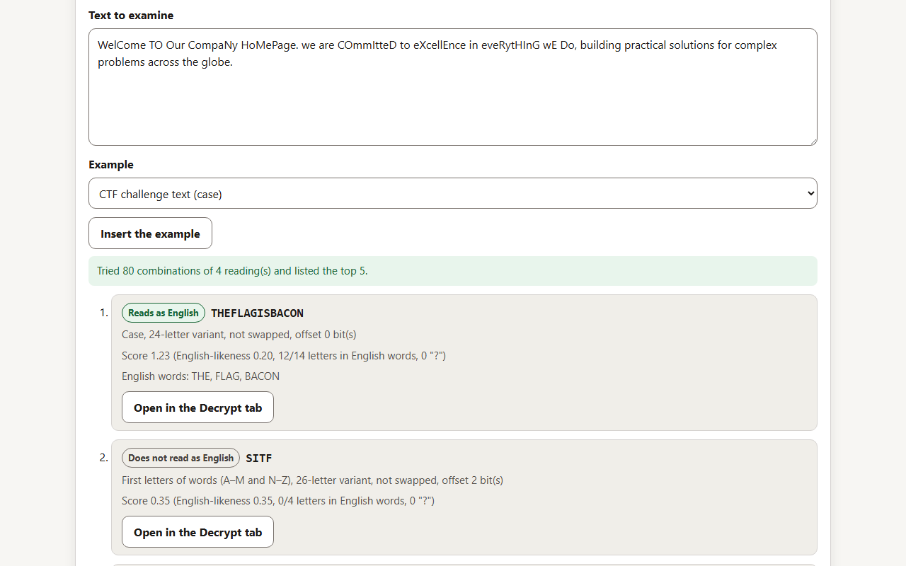
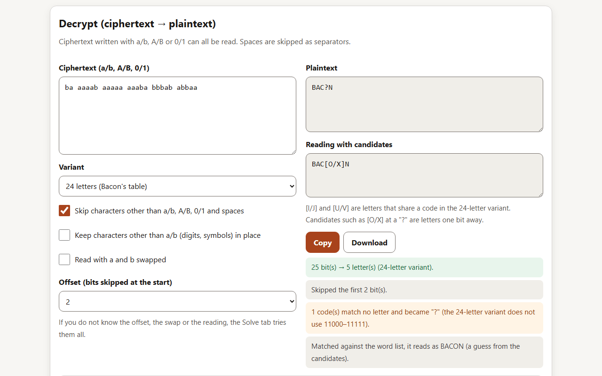
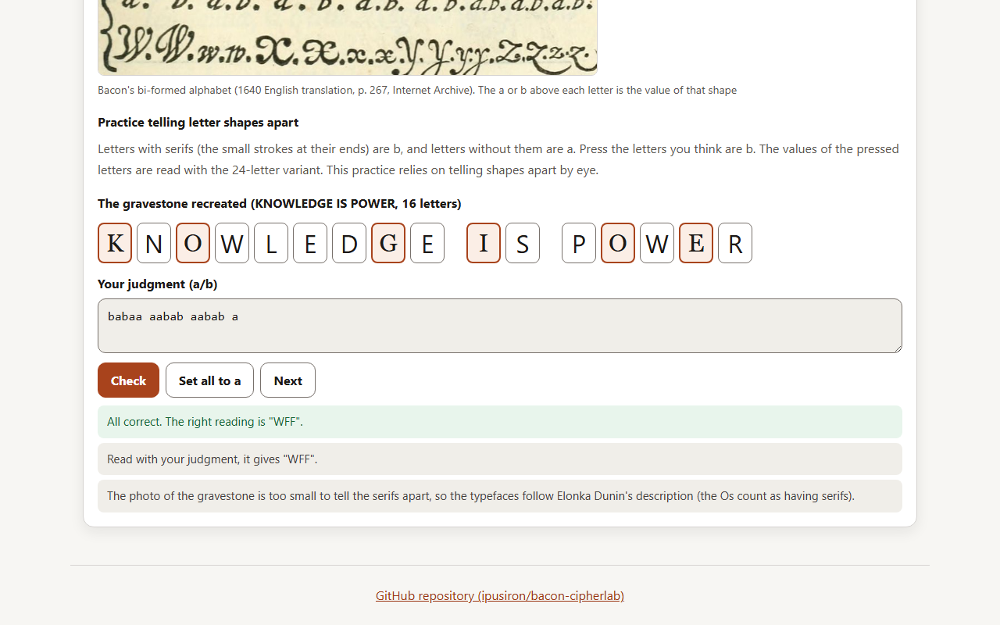
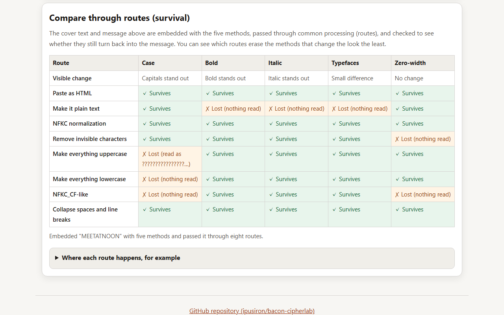
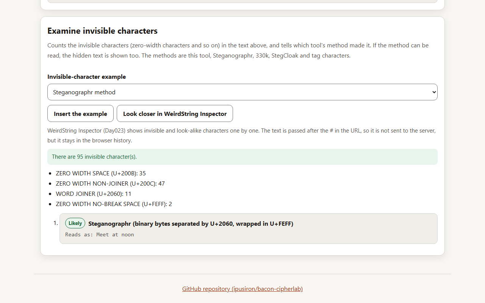
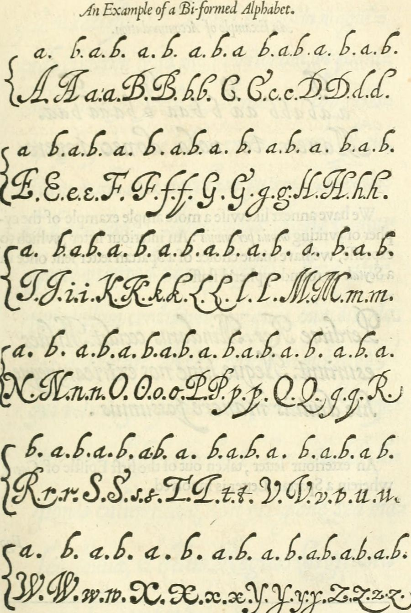

# 🥓 Bacon CipherLab - Interactive Bacon's Cipher Learning Tool

English · [日本語](README.md)


[](https://ipusiron.github.io/bacon-cipherlab/)

**Day055 - 100 Security Tools with Generative AI**

Bacon CipherLab is a tool for trying Bacon's cipher. Each letter becomes a code of five a/b symbols, and the sequence is then hidden in the shapes of the letters of a text (uppercase and lowercase, bold, italic) or in invisible zero-width characters. You can follow the whole round trip of conversion, embedding and extraction with both the 24-letter table Bacon published in 1623 and the later 26-letter variant. Decryption that copes with offsets, swapped a and b and misread codes, and a Solve tab that tries every reading, let you examine texts even when you do not know how they were hidden. A Biform tab tries Bacon's bi-formed alphabet with two typefaces, and a table compares which methods survive common processing. It can also count invisible characters, tell the methods of other tools (Steganographr, 330k, StegCloak) and tag characters apart, and pass the text to WeirdString Inspector. Nothing is sent over the network.

---

## 🌐 Demo

👉 **[https://ipusiron.github.io/bacon-cipherlab/](https://ipusiron.github.io/bacon-cipherlab/)**

Try it directly in your browser.

---

## 📸 Screenshots

>
>
>*Embedding with zero-width characters, with their positions shown*

>
>
>*The Encrypt tab and the letter-by-letter view*

>
>
>*Notes in the Decrypt tab (dark mode)*

>
>
>*The Extract tab reading a message from bold HTML*

>
>
>*The 24-letter table (dark mode)*

>
>
>*Preview of a message embedded in bold*

>
>
>*A CTF challenge text examined in the Solve tab*

>
>
>*The Decrypt tab reading a ciphertext shifted by 2 bits with an offset*

>
>
>*The Biform tab after telling letter shapes apart in the recreated gravestone*

>
>
>*The table comparing five methods through eight routes*

>
>
>*The invisible-character card identifying and reading the Steganographr method*

---

## 🥓 What is Bacon's cipher?

In The Advancement of Learning (1605), Francis Bacon (1561–1626) named three virtues of ciphers.

- They are not laborious to write and read
- They are impossible to decipher
- In some cases, they are without suspicion

He set out the method itself, with a table and an example, in Book VI, Chapter 1 of the Latin De Augmentis Scientiarum (1623). Bacon wrote that he devised it in his youth, when he was in Paris. Gilbert Wats's English translation followed in 1640; the figure below shows the table printed there.

>
>
>*Bacon's table in the 1640 English translation (p. 266)*

The 24 letters each get a code of five a/b symbols. I and J, and U and V, count as one letter; the table writes them as I and V.

To hide the codes in a text, you prepare a "Bi-formed Alphabet", in which every letter can be written in two forms (an a-form and a b-form). You then choose the form of each letter of the visible text (the exterior letter) to match the a/b symbols of the hidden text (the interior letter). Bacon's example hides Fuge ("flee") in Manere te volo donec venero ("I want you to stay until I come").

>
>
>*Bacon's example (Fuge fitted to the exterior letter, p. 268)*

The symbols for F, V, G and E (aabab, baabb, aabba, aabaa) go one by one onto the letters of the exterior letter. Bacon wrote that the exterior letter is five times as long as the interior one, and that no other condition is needed. He also wrote that anything with a twofold difference will do, such as bells, trumpets, lights and torches, or the report of muskets.

Bacon also printed an example of the bi-formed alphabet, in which every letter can be written in two shapes. The a or b above each letter is the value of that shape.

>
>
>*Bacon's bi-formed alphabet (p. 267)*

The case, bold, italic and two-typeface methods of this tool are an easy modern version of the bi-formed alphabet. The two-typeface method makes letters in a serif typeface b and letters in a sans-serif typeface a (the same direction as the Friedmans' gravestone). The 26-letter variant (A = aaaaa to Z = bbaab), which gives every letter its own code, is a later variant and not Bacon's own table.

---

## ✨ Features

### Encrypt

- Replaces each letter with a five-symbol code, written as a/b, A/B or 0/1, grouped every 5, every 10 or not at all
- Reads full-width letters as ASCII letters. Leaves out everything else (digits, symbols, non-Latin text) and says how many were left out
- In the 24-letter variant, gives J the code of I and V the code of U, and says how many were replaced
- Updates the result as you type. A letter-by-letter view is available

### Decrypt

- Reads ciphertext written with a/b, A/B or 0/1. Spaces are skipped as separators
- Other characters are either skipped, or reading stops and the position of the first one is shown
- Reports trailing bits that are fewer than five, and codes that match no letter (shown as "?")
- Reads with an offset (bits skipped at the start, 0 to 4) and with a and b swapped
- Can keep characters other than a/b (digits, symbols) in place (for flag formats such as `B4CON`)
- Shows a reading with candidates: I and U in the 24-letter variant as [I/J] and [U/V], and letters one bit away from a "?" (for example [O/X])
- Shows a reading that fills in J, V and "?" to match a list of English words (for example ILOUEBACON → ILOVEBACON, BAC?N → BACON)

### Embed

- Hides the a/b symbols of a message in a cover text with five methods (case, bold, italic, two typefaces, zero-width characters)
- Shows how many carriers are needed and how many the cover text has
- With the case method, makes letters after the message lowercase (a); this can be turned off
- For zero-width characters, the preview can show where each one went. Emoji and combining characters stay intact
- Copy as text or HTML, or download the HTML. "Read it in the Extract tab" checks the round trip
- "Compare through routes" passes the five methods through eight routes (making it plain text, removing invisible characters, normalizing case and so on) and shows in a table whether the message comes back

### Extract

- Reads case and zero-width characters from text, and bold, italic and typefaces from HTML (including the way Word and Google Docs write it)
- Drops the trailing padding (groups of aaaaa) and says how many letters were dropped
- Reports zero-width characters this tool does not use (ZWJ, WORD JOINER, BOM), if any

### Solve

- Takes anything in the pasted text that comes in two kinds as a reading (a/b symbols, uppercase and lowercase, A–M and N–Z, first letters of words, consonants and vowels, exactly two kinds of symbols, bold, italic and typefaces, zero-width characters)
- Tries every reading × variant (24 or 26 letters) × a/b swap × offset (0 to 4 bits), and lists the five best with the reading, variant, offset and score breakdown
- "Open in the Decrypt tab" puts a candidate's ciphertext and settings into the Decrypt tab to check it
- Examples (a CTF challenge text, a ciphertext shifted by 2 bits, two kinds of emoji, first letters of words, zero-width characters) can be inserted from the page
- "Examine invisible characters" counts invisible characters by name and tells which tool's method made the text (this tool, Steganographr, 330k, StegCloak, tag characters). If the method can be read, the hidden text is shown
- The text can be passed to WeirdString Inspector (Day023) after the # in the URL (from the Solve and Extract tabs)

### Biform

- Practice judging a and b by pressing each letter of a text drawn in two typefaces, with Bacon's bi-formed alphabet (1640 English translation, p. 267) as a guide
- The first problem recreates the Friedmans' gravestone (the answer is WFF). There are 12 more practice problems
- Checking marks the letters that were judged wrong

### Table

- Tables for the 24-letter and 26-letter variants. Switch the symbols, swap a and b, and press a cell to copy its code
- Shows the codes that match no letter (11000–11111 in the 24-letter variant, 11010–11111 in the 26-letter variant)

### Common

- Switch between Japanese and English (or open with `?lang=en`), and between light and dark
- Works with the keyboard (arrow keys, Home and End move between tabs) and with screen readers
- Sends nothing over the network. Only the language and theme choices are saved

---

## 📖 How to use

1. Type plaintext (letters) in the Encrypt tab and the ciphertext appears. Choose the variant (24 or 26 letters) and the symbols
2. Type ciphertext in the Decrypt tab and the plaintext comes back
3. In the Embed tab, type a cover text and the message to hide, and choose a method. Check the preview and the notes to see that it worked
4. Press "Read it in the Extract tab" to put the result into the Extract tab and see that it turns back into the message
5. Hand over text embedded in bold or italic as copied HTML or a downloaded file. Case and zero-width characters can be copied as plain text
6. Paste a text you received into the Extract tab and read it with the same method and variant used for embedding
7. Paste a text whose hiding method you do not know into the Solve tab. Use "Open in the Decrypt tab" on a top candidate to check the offset and swap
8. Practice telling letter shapes apart in the Biform tab. Use "Compare through routes" in the Embed tab to see which processing erases which method

---

## 🔬 Technical notes

### Code table

| Letter | 24 letters | 26 letters |
|---|---|---|
| A | aaaaa | aaaaa |
| B | aaaab | aaaab |
| C | aaaba | aaaba |
| D | aaabb | aaabb |
| E | aabaa | aabaa |
| F | aabab | aabab |
| G | aabba | aabba |
| H | aabbb | aabbb |
| I | abaaa | abaaa |
| J | abaaa (same as I) | abaab |
| K | abaab | ababa |
| L | ababa | ababb |
| M | ababb | abbaa |
| N | abbaa | abbab |
| O | abbab | abbba |
| P | abbba | abbbb |
| Q | abbbb | baaaa |
| R | baaaa | baaab |
| S | baaab | baaba |
| T | baaba | baabb |
| U | baabb | babaa |
| V | baabb (same as U) | babab |
| W | babaa | babba |
| X | babab | babbb |
| Y | babba | bbaaa |
| Z | babbb | bbaab |

In the 24-letter variant, J has the same code as I, and V the same code as U. When written with 0/1, a = 0 and b = 1.

### Examples

| Plaintext | 24 letters | 26 letters |
|---|---|---|
| HELLO | `aabbb aabaa ababa ababa abbab` | `aabbb aabaa ababb ababb abbba` |
| SOS | `baaab abbab baaab` | `baaba abbba baaba` |
| Fuge | `aabab baabb aabba aabaa` | `aabab babaa aabba aabaa` |

### Methods and carriers

| Method | a | b | Carrier | Where it tends to survive | What removes it |
|---|---|---|---|---|---|
| Case | Lowercase | Uppercase | Letters (A–Z, a–z) | Plain text in general | Processing that normalizes case |
| Bold | Normal | Bold | Characters other than spaces | HTML and word-processor documents | Copying as plain text |
| Italic | Normal | Italic | Characters other than spaces | HTML and word-processor documents | Copying as plain text |
| Two typefaces | Sans-serif | Serif | Characters other than spaces | HTML and word-processor documents | Copying as plain text |
| Zero-width characters | U+200B | U+200C | The place after each character | Most plain text | Processing that removes zero-width characters |

Each carrier carries one bit. A letter needs five carriers, so the cover text needs at least five times as many carriers as the letters to hide. For bold, italic, two typefaces and zero-width characters, characters are counted as graphemes (what looks like one character, including emoji sequences and combining characters). Bold spaces are invisible, so spaces are not used as carriers.

### End of the message

Bacon's cipher has no symbol for the end of a message. If the cover text is longer than the message, the carriers after it are read as well. So embedding sets the carriers after the message to a (lowercase for case; bold and italic simply stay normal), and extraction drops trailing "all a" groups (the letter A) as padding. If the message ends in A, uncheck the box in the Extract tab to keep them. Trailing bits fewer than five are not read.

### How bold, italic and typeface HTML is read

- Bold: `b` and `strong` tags, `class="bacon-bold"`, and `font-weight` of `bold`, `bolder` or 600 and above
- Italic: `i` and `em` tags, `class="bacon-italic"`, and `font-style` of `italic` or `oblique`
- Typeface: the first family name in `font-family` (the `face` of a `font` tag is read too). Names such as sans, Arial, Helvetica, Segoe, Calibri, Gothic and Meiryo are sans-serif; names such as serif, Times, Georgia, Garamond, Cambria and Mincho are serif. Characters with no typeface inherit the outer one
- `font-weight: normal` or `font-style: normal` inside turns it back to normal (Google Docs wraps everything in `<b style="font-weight:normal">`)
- Declarations with other names such as `mso-bidi-font-weight` are ignored (Word writes them)
- The contents of `script`, `style` and similar elements, and comments, are not read. Character references such as `&amp;` become characters

HTML embedded with two typefaces wraps everything in a sans-serif span (`'Segoe UI', Arial, Helvetica, sans-serif`) and puts b letters in serif spans (`Georgia, 'Times New Roman', Times, serif`). The lists end in `sans-serif` and `serif`, so the distinction between serif and sans-serif is meant to hold even where the named typefaces are missing.

HTML is parsed by reading its tokens in the core, not by the browser's HTML parser, because letting the browser parse `style` attributes under the CSP reports violations.

### Offsets, swaps and candidates for misreadings

Extra bits at the start of a ciphertext shift the five-bit boundaries and produce other letters. The "Offset" in the Decrypt tab sets how many bits (0 to 4) to skip at the start. If a and b were assigned the other way round, read with them swapped.

A code that matches no letter ("?") may be a one-bit misreading. Codes that match a letter when one bit is changed are shown as candidates, such as [O/X]. In the 24-letter variant, I and J, and U and V, share a code, so I and U are shown as [I/J] and [U/V]. A reading that fills in J, V and "?" to match the core's list of English words (204 words) is also shown. It is a guess from the candidates.

"Keep characters other than a/b in place" puts each non-symbol character after the letters read before it. In ciphertext written with a/b letters, the digits 0 and 1 are also kept as characters rather than read as symbols.

### Readings and scores in the Solve tab

| Reading | Becomes a | Becomes b | Taken from |
|---|---|---|---|
| a/b, A/B, 0/1 symbols | a, A, 0 | b, B, 1 | Texts where at least 80% of non-space characters are symbols |
| Case | Lowercase | Uppercase | Letters |
| A–M and N–Z (each letter) | A–M | N–Z | Letters (either case) |
| First letters of words (A–M and N–Z) | Words starting with A–M | Words starting with N–Z | The first letter of each space-separated word |
| Consonants and vowels | Consonants | Vowels (A, E, I, O, U) | Letters |
| Two kinds of symbols | The symbol that appears first | The other symbol | Texts with exactly two kinds of non-space characters (counted as graphemes) |
| Bold | Normal | Bold | Non-space characters in HTML |
| Italic | Normal | Italic | Non-space characters in HTML |
| Two typefaces | Sans-serif | Serif | Non-space characters in HTML (judged by the font-family name) |
| Zero-width characters | U+200B | U+200C | Zero-width characters |

Because swaps are tried anyway, a reading that is only another reading with a and b swapped is left out. Each reading is read with the 24- and 26-letter variants, with and without the swap, and with offsets of 0 to 4 bits; the trailing padding (groups of aaaaa) is dropped before scoring.

The score is English-likeness + 1.2 × the share of letters covered by English words − 2 × the share of "?" − the bias toward one letter. English-likeness is the log-likelihood per letter under English letter frequencies (the table in Wikipedia's "Letter frequency", sourced from Lewand's 2000 book), compared with a uniform distribution. For readings of six letters or more, the bias subtracts four times the amount by which the most common letter exceeds 30%. Readings shorter than four letters lose 1. A score of 1 or more is shown as "Reads as English", and 0.5 or more as "Might be English".

| Example | Top reading | Reading | Variant | Offset |
|---|---|---|---|---|
| CTF challenge text (case) | `THEFLAGISBACON` | Case | 24-letter variant | 0 |
| Ciphertext shifted by 2 bits | `ATTACKATDAWN` | a/b, A/B, 0/1 symbols | 24-letter variant | 2 |
| Two kinds of emoji | `BACONANDEGGS` | Two kinds of symbols | 26-letter variant | 0 |
| First letters of words (A–M and N–Z) | `STOP` | First letters of words (A–M and N–Z) | 24-letter variant | 0 |
| Zero-width characters | `MEETATNOON` | Zero-width characters | 24-letter variant | 0 |

### Zero-width characters

U+200B (ZERO WIDTH SPACE) and U+200C (ZERO WIDTH NON-JOINER) are both format characters (General Category Cf) that are normally not displayed (Default_Ignorable_Code_Point). They are not always invisible, though. Editors that show hidden characters display them, and U+200C breaks joining and ligatures in scripts such as Arabic. In justified text, the spacing may also change. The NFKC_CF normalization of Unicode removes them.

### Survival through routes

"Compare through routes" in the Embed tab embeds the cover text and message with the five methods, passes the result through the eight routes below, extracts it, and checks whether the message comes back. The routes are applied to the HTML string; case and zero-width characters are read from its text, and bold, italic and typefaces from the HTML.

- Paste as HTML: pasting with formatting into a rich-text editor or an email
- Make it plain text: pasting into a field with no formatting (a text editor, many posting forms). Bold, italic and typefaces disappear
- NFKC normalization: processing that unifies full-width and half-width forms. Letters stay, and so do zero-width characters
- Remove invisible characters: processing that deletes characters that are normally not displayed (Default_Ignorable_Code_Point), such as zero-width characters
- Make everything uppercase: processing that puts headings or subject lines in capitals
- Make everything lowercase: a step before case-insensitive comparison or search
- NFKC_CF-like: NFKC, removal of invisible characters and lowercasing together (an approximation of one of the Unicode normalizations)
- Collapse spaces and line breaks: formatting that turns runs of spaces and line breaks into one space

The NFKC_CF-like route is an approximation that applies NFKC, removal of invisible characters and lowercasing in turn; it is not exactly Unicode's NFKC_Casefold. The table below is the result of embedding MEET AT NOON in the article text of Scenario 1 (for case, letters after the message are made lowercase).

| Route | Case | Bold | Italic | Typefaces | Zero-width |
|---|---|---|---|---|---|
| Visible change | Capitals stand out | Bold stands out | Italic stands out | Small difference | No change |
| Paste as HTML | Survives | Survives | Survives | Survives | Survives |
| Make it plain text | Survives | Lost | Lost | Lost | Survives |
| NFKC normalization | Survives | Survives | Survives | Survives | Survives |
| Remove invisible characters | Survives | Survives | Survives | Survives | Lost |
| Make everything uppercase | Lost | Survives | Survives | Survives | Survives |
| Make everything lowercase | Lost | Survives | Survives | Survives | Survives |
| NFKC_CF-like | Lost | Survives | Survives | Survives | Lost |
| Collapse spaces and line breaks | Survives | Survives | Survives | Survives | Survives |

Zero-width characters do not change the look, but disappear when invisible characters are removed. Two typefaces differ only slightly, but disappear in plain text. Case survives plain text, but disappears when case is normalized.

### Zero-width methods of other tools

"Examine invisible characters" in the Solve tab counts invisible characters with their names (Unicode UCD 18.0.0) and tells the method apart from the set of characters used. If only that method's characters are used, it is shown as "Likely"; if other characters are mixed in, as "Possible". ZWJs that join emoji and variation selectors are not counted. The methods follow each tool's source.

| Method | Invisible characters | Encoding | How this tool handles it |
|---|---|---|---|
| Bacon CipherLab | U+200B (a), U+200C (b) | Five bits per letter of Bacon's cipher, one after each character | Reads it with the 24- and 26-letter variants and shows the more English-like one |
| Steganographr | U+200B (0), U+200C (1), U+2060 (separator), U+FEFF (boundaries) | Each UTF-8 byte in binary (no padding), in one place in the middle of the text | Reads it |
| 330k Unicode Steganography | By default U+200C, U+200D, U+202C, U+FEFF (0 to 3 in that order) | Each UTF-16 unit as eight base-4 digits, scattered between runs of text (order kept) | Reads it only with the default four characters |
| StegCloak | U+200C, U+200D, U+2061 to U+2064 | Compressed (lzutf8), encrypted (AES-256-CTR) if a password is given, then two bits at a time, in one place | Identifies it but does not read it |
| Tag characters | U+E0000 to U+E007F | U+E0000 added to each ASCII character (ASCII smuggling) | Turns U+E0020 to U+E007E back into ASCII |

For the 330k method, text made by running that tool's source (from 2016) locally was checked to read the same in this tool. Steganographr runs as PHP on its server, so it is read by following the same steps as its source.

The link to WeirdString Inspector (Day023) puts the URL-encoded text in `#text=` and adds `source=bacon-cipherlab`. The part after the # is not sent to the server, but it stays in the browser history. If the URL would exceed 200,000 characters, or the text contains characters that cannot go into a URL (lone surrogates), the link is disabled and the reason is shown. At exactly the limit, the published WeirdString Inspector was checked to receive the text without losing a single character.

### Biform practice

The Biform tab has 13 problems, the first of which recreates the gravestone. The two typefaces use the same family lists as the two-typeface method. The photo of the gravestone (Wikimedia Commons) is too small to tell the serifs apart, so the typefaces follow Elonka Dunin's description. Each practice text has at least five times as many letters as the hidden word.

---

## 🪦 The Friedmans' gravestone

The gravestone of the American cryptologist William F. Friedman and his wife Elizebeth (Arlington National Cemetery) reads KNOWLEDGE IS POWER. The letters are cut in two typefaces, with and without serifs.


Make the letters with serifs uppercase and the others lowercase (following Elonka Dunin, the Os are treated as having serifs).

```text
KnOwledGe Is pOwEr
```

Take uppercase as b and lowercase as a, and split into groups of five.

```text
KnOwl edGeI spOwE r
babaa aabab aabab a
```

Read with the 24-letter variant (Bacon's table), this gives WFF, William F. Friedman's initials. The final a is padding. Read with the 26-letter variant, it gives UFF, which are not his initials. Whether the Os have serifs is debatable, but Elonka Dunin cites a note from Elizebeth to William's biographer R. Clark (in the papers at the Marshall Library) saying that WFF was the intended text.

In this tool, set the method to "Case" and the variant to "24 letters" in the Extract tab and paste `KnOwledGe Is pOwEr` to get WFF.

The photo is "ANCExplorer William F. Friedman grave" on Wikimedia Commons (public domain).

---

## 🎯 Use cases

### Ways of using this tool in particular

- Noticing misreadings through unused codes (a lesson on error detection): of the 32 five-bit codes, the 24-letter version leaves 8 unused and the 26-letter version leaves 6. If the case of a single letter is misread, the result lands on an unused code and looks wrong in only 16 of 120 cases (13.3%) for the 24-letter version and 16 of 130 cases (12.3%) for the 26-letter version. The rest silently turn into another letter. A class can count this to see why parity and error-detecting codes are needed
- Estimating how much fits in a cover text (the efficiency of steganography): the case method carries one letter in five Latin letters. The CTF example sentence below (127 Latin letters) hides up to 25 letters, and the post in Scenario 2 (21 characters) hides up to 4 letters with zero-width characters. Puzzle and CTF authors can work back from the length of the answer to the length of the cover text
- Comparing with 5-bit telegraph codes: the Baudot code used in telegraphy also writes one character in 5 bits. While Bacon's cipher fits its 24 or 26 letters, telegraphy also needed digits and symbols, so it added codes that switch between letters and figures to stretch the 32 slots. In a class on the history of communication, show side by side why this tool drops `{}` and digits and how telegraphy solved the same constraint

### Classes and self-study

- Show the step that turns letters into codes (substitution) apart from the step that hides the codes in a text (concealment), to explain the difference between cryptography and steganography
- Follow Bacon's Fuge example and the Friedmans' gravestone in the Encrypt and Extract tabs
- Use it as an introduction to binary numbers: five bits give 32 patterns, enough for both 24 and 26 letters, as the table shows
- Practice telling letter shapes apart in the Biform tab, with Bacon's bi-formed alphabet as a guide

### Setting and solving CTF challenges

This kind of challenge hides the answer in the case of the letters of the text. The text below hides THE FLAG IS BACON with the case method and the 24-letter variant.

```text
WelCome TO Our CompaNy HoMePage. we are COmmItteD to eXcellEnce in eveRytHInG wE Do, building practical solutions for complex problems across the globe.
```

→ `THEFLAGISBACON` (case, 24 letters)

- When solving, look for anything that comes in two kinds: uppercase and lowercase, bold and normal, two kinds of symbols
- Try both the 24-letter and 26-letter variants, and also try swapping a and b. Pasting the challenge text into the Solve tab tries every reading, variant, swap and offset
- `{}` and digits cannot be written in Bacon's cipher, so when setting a challenge, state the flag format separately in the text

### Scenario 1: hiding in an article (fictional example)

A fictional scenario: someone in a censored place passes on a meeting time disguised as an ordinary article. The case method hides MEET AT NOON.

```text
cOnSTruCtion WorK in The city Is gOinG Well TOdAy. MAnY wORkers are busy at the new bridge, and good weather is expected for tomorrow.
```

→ `MEETATNOON` (case, 24 letters)

Capitals in the middle of sentences look unnatural, so a careful censor would notice. As with Bacon's bi-formed alphabet, the smaller the difference in shape, the less suspicion it raises.

### Scenario 2: hiding in a post with zero-width characters (fictional example)

The post looks ordinary, but zero-width characters after its letters hide HELP. The block below really contains zero-width characters.

```text
L​o​v‌e‌l‌y​ ​w‌e​a​t​h‌e​r‌ ​t​o‌d‌a‌y​. Fancy a walk in the park?
```

→ `HELP` (zero-width characters, 24 letters)

If the service where it is posted removes zero-width characters, the message disappears too. Before handing it over, check that the Extract tab can read it.

### Other uses

- Puzzles for escape rooms and puzzle events (the case of letters on a poster, letters in two colors)
- A marker for telling copies apart: give each copy of a document a different sequence and see which one got out
- Two-way signals (blinking lights, long and short sounds, beads or stitches in two colors). Bacon himself mentions bells, trumpets and lights
- Practice in telling typefaces apart (serif and sans-serif, roman and italic)

### From the finder's side

- Check whether letter case switches more often than in ordinary text
- Use "Examine invisible characters" in the Solve tab to see how many invisible characters there are and which tool's method they follow. Passing the text to [WeirdString Inspector](https://ipusiron.github.io/weirdstring-inspector/) (Day023) lets you check invisible characters one by one
- Check whether bold or italic is scattered without regard to meaning
- Use the table in the Embed tab to see which processing erases a hidden message (zero-width characters disappear when invisible characters are removed; bold, italic and typefaces disappear in plain text)

---

## 📊 Comparison with other classical ciphers

| Item | Bacon's cipher | Caesar cipher | Vigenère cipher | Playfair cipher |
|---|---|---|---|---|
| Date | Table published in 1623 | 1st century BC (recorded by Suetonius) | Described by Bellaso in 1553 | Devised by Wheatstone in 1854 |
| Type | Substitution + steganography | Monoalphabetic substitution (fixed shift) | Polyalphabetic substitution (repeating key) | Digraph substitution (5×5 square) |
| Aim of secrecy | Not letting anyone notice a cipher is in use | Making the text unreadable | Resisting frequency analysis | Resisting frequency analysis |
| Security | Low (once the five-symbol groups are taken out, it is monoalphabetic substitution), but hard to notice | Very low (only 25 shifts) | No solution was published until Kasiski published a general attack in 1863 | Mauborgne published a solution in 1914 |
| Tool in this project | [Bacon CipherLab](https://ipusiron.github.io/bacon-cipherlab/) | [Caesar Cipher Wheel](https://ipusiron.github.io/caesar-cipher-wheel/) | [Vigenere Cipher Tool](https://ipusiron.github.io/vigenere-cipher-tool/) | [Playfair CipherLab](https://ipusiron.github.io/playfair-cipherlab/) |

---

## 🔒 Security

- Everything runs in the browser, and nothing is sent over the network
- The CSP is `default-src 'self'; script-src 'self'; style-src 'self'; img-src 'self' data:; connect-src 'none'; object-src 'none'; base-uri 'none'; form-action 'none'`
- All text on the page is shown with `textContent` and built elements; `innerHTML` is not used. Pasted HTML is read token by token without being put into the DOM
- The downloaded HTML contains only the embedded text, with no scripts
- `localStorage` holds only the language and theme choices, and the page works where it is unavailable

---

## ⚠️ Notes and limitations

- Bacon's cipher is a classical cipher with no key. Anyone who takes out the codes can read them, so it cannot protect secrets
- Hiding only makes the message harder to notice. Unnatural case, scattered bold or italic, and the presence of zero-width characters give it away
- Bold and italic survive only in HTML and word-processor documents. Zero-width characters disappear when a service or editor removes them
- Extraction drops trailing "all a" groups as padding. If the message ends in A, uncheck the box to keep them
- Characters other than letters (digits, symbols, non-Latin text) cannot be encrypted
- With two typefaces, other typefaces are substituted where the named ones are missing. The distinction between serif and sans-serif is meant to hold, but how different they look depends on the environment
- The Biform practice relies on telling shapes apart by eye, so it cannot be used with a screen reader
- The methods of other tools are inferred from the set of characters used. StegCloak compresses (and encrypts if a password is given), so it is not read. 330k can be read only with its default four characters (text made with other characters cannot be read)
- The Solve score is a guide based on English letter frequencies and a list of English words. For short texts or texts not in English (such as Latin), the right reading may not come out on top. Even for English text that hides nothing, a short word may appear as "Might be English"
- Each field accepts up to 100,000 characters
- The author does not encourage uses that deceive or harm people

---

## 🧪 Tests

```bash
npm test
```

- Runs with `node --test` on Node.js 22 or later, with no dependencies (no `npm install` needed)
- Runs on GitHub Actions for every push and pull request
- `test/core.test.js`: the 24 rows of Bacon's original table and the 26-letter table, known answers for Fuge, HELLO, SOS and the gravestone, notes from decryption, round trips for 5 methods × 2 variants, intact emoji, reading HTML tokens (including typeface names), the survival table (5 methods × 8 routes), the answers of the practice problems, counting invisible characters and identifying and reading other tools' methods, the link to WeirdString Inspector, offset, swap and kept-character readings, one-bit candidates and readings matched to English words, and every Solve example coming out on top
- `test/html.test.js`, `test/contrast.test.js`, `test/messages.test.js`, `test/i18n.test.js`, `test/format.test.js`: the CSP, tab ARIA, dictionary and page text, color contrast (4.5:1 and 3:1), and formatting
- `test/readme.test.js`: checks the README's code table, examples, Solve examples, survival table, gravestone and use cases against the core, and the headings, images and directory structure of the Japanese and English READMEs

---

## 🔗 References

- [Francis Bacon, The Advancement of Learning (transcription of the 1605 first edition, EEBO-TCP A01516)](https://github.com/textcreationpartnership/A01516)
- [Francis Bacon, The Advancement of Learning (Project Gutenberg #5500)](https://www.gutenberg.org/ebooks/5500)
- [Francis Bacon, De Dignitate et Augmentis Scientiarum (1623, Internet Archive)](https://archive.org/details/aoperafranciscib00baco)
- [Francis Bacon, Of the Advancement and Proficience of Learning (1640, Internet Archive)](https://archive.org/details/ofadvancementp00baco)
- [Francis Bacon, Of the Advancement and Proficience of Learning (transcription of 1640, EEBO-TCP A72146)](https://github.com/textcreationpartnership/A72146)
- [Stanford Encyclopedia of Philosophy, "Francis Bacon"](https://plato.stanford.edu/entries/francis-bacon/)
- [Elonka Dunin, "Cipher on the William and Elizebeth Friedman tombstone"](https://elonka.com/friedman/)
- [Wikimedia Commons, "ANCExplorer William F. Friedman grave"](https://commons.wikimedia.org/wiki/File:ANCExplorer_William_F._Friedman_grave.jpg)
- [Unicode Character Database 18.0.0](https://www.unicode.org/Public/18.0.0/ucd/)
- [The Unicode Standard, Version 18.0 Core Specification](https://www.unicode.org/versions/Unicode18.0.0/core-spec/)
- [W3C, "Content Security Policy Level 3"](https://www.w3.org/TR/CSP3/)
- [WHATWG HTML Standard, "Pragma directives"](https://html.spec.whatwg.org/multipage/semantics.html#pragma-directives)
- [Wikipedia, "Letter frequency"](https://en.wikipedia.org/wiki/Letter_frequency)
- [330k, "misc_tools" (Unicode Steganography with Zero-Width Characters)](https://github.com/330k/misc_tools)
- [KuroLabs, "StegCloak"](https://github.com/KuroLabs/stegcloak)
- [Neatnik, "Steganographr" source](https://source.tube/neatnik/steganographr)
- [CyberChef (Bacon.mjs)](https://github.com/gchq/CyberChef/blob/master/src/core/lib/Bacon.mjs)
- [dCode, "Bacon Cipher"](https://www.dcode.fr/bacon-cipher)

---

## 📁 Directory structure

```text
bacon-cipherlab/
├── .github/                       # GitHub settings
│   └── workflows/                 # GitHub Actions workflows
│       └── test.yml               # Runs npm test on push and pull request
├── assets/                        # Images for the README
│   ├── en/                        # Screenshots of the English page
│   │   ├── screenshot.png         # Embedding with zero-width characters (English)
│   │   ├── screenshot2.png        # Encrypt tab (English)
│   │   ├── screenshot3.png        # Notes in the Decrypt tab (English, dark)
│   │   ├── screenshot4.png        # Extracting from bold HTML (English)
│   │   ├── screenshot5.png        # Table (English, dark)
│   │   ├── screenshot6.png        # Embedding in bold (English)
│   │   ├── screenshot7.png        # Solve tab (English)
│   │   ├── screenshot8.png        # Decrypting with an offset (English)
│   │   ├── screenshot9.png        # Biform tab (English)
│   │   ├── screenshot10.png       # Route table (English)
│   │   └── screenshot11.png       # Invisible-character card (English)
│   ├── bacon-1640-accommodation.jpg # Bacon's example (1640 translation, p. 268)
│   ├── bacon-1640-biform.jpg      # Bacon's bi-formed alphabet (1640 translation, p. 267; also used on the page)
│   ├── bacon-1640-table.jpg       # Bacon's table (1640 translation, p. 266)
│   ├── screenshot.png             # Embedding with zero-width characters
│   ├── screenshot2.png            # Encrypt tab
│   ├── screenshot3.png            # Notes in the Decrypt tab (dark)
│   ├── screenshot4.png            # Extracting from bold HTML
│   ├── screenshot5.png            # Table (dark)
│   ├── screenshot6.png            # Embedding in bold
│   ├── screenshot7.png            # Solve tab
│   ├── screenshot8.png            # Decrypting with an offset
│   ├── screenshot9.png            # Biform tab
│   ├── screenshot10.png           # Route table
│   └── screenshot11.png           # Invisible-character card
├── js/                            # Scripts loaded by the page
│   ├── bacon-core.js              # Core (tables, encryption, decryption, embedding, extraction, HTML token reading, solving)
│   ├── i18n.js                    # Language choice and replacement of text in the HTML
│   ├── messages.js                # Japanese and English text
│   ├── theme-init.js              # Applies the saved theme before drawing
│   └── theme.js                   # Light and dark switch
├── test/                          # Automated tests (node --test)
│   ├── contrast.test.js           # Color contrast and size of controls
│   ├── core.test.js               # Core
│   ├── format.test.js             # Line length, line endings, control characters
│   ├── html.test.js               # CSP, tab ARIA, text and HTML match
│   ├── i18n.test.js               # How the language is chosen
│   ├── load.js                    # Loads the page's scripts into the tests
│   ├── messages.test.js           # Japanese and English dictionaries
│   └── readme.test.js             # README tables, examples, headings, images, directory structure
├── .gitignore                     # Files kept out of Git
├── .nojekyll                      # Turns off Jekyll on GitHub Pages
├── CLAUDE.md                      # Notes for development (for Claude Code)
├── LICENSE                        # MIT License
├── README.en.md                   # This file
├── README.md                      # Japanese README
├── index.html                     # Page
├── package.json                   # npm test definition (no dependencies)
├── script.js                      # Page logic
└── style.css                      # Styles (light and dark)
```

---

## 💻 Requirements

- A recent browser (checked with Chromium, Edge and Firefox; Safari not checked)
- Opening `index.html` directly works. To use a local HTTP server:

```bash
python -m http.server 8000
# open http://localhost:8000/
```

---

## 📄 License

MIT License - see [LICENSE](LICENSE).

---

## 🛠️ About this tool

This tool was built as part of the "100 Security Tools with Generative AI" project.
The project builds and publishes a wide range of security tools over 100 days with the help of AI.

For details and the other tools, see:

🔗 [https://akademeia.info/?page_id=42163](https://akademeia.info/?page_id=42163)
