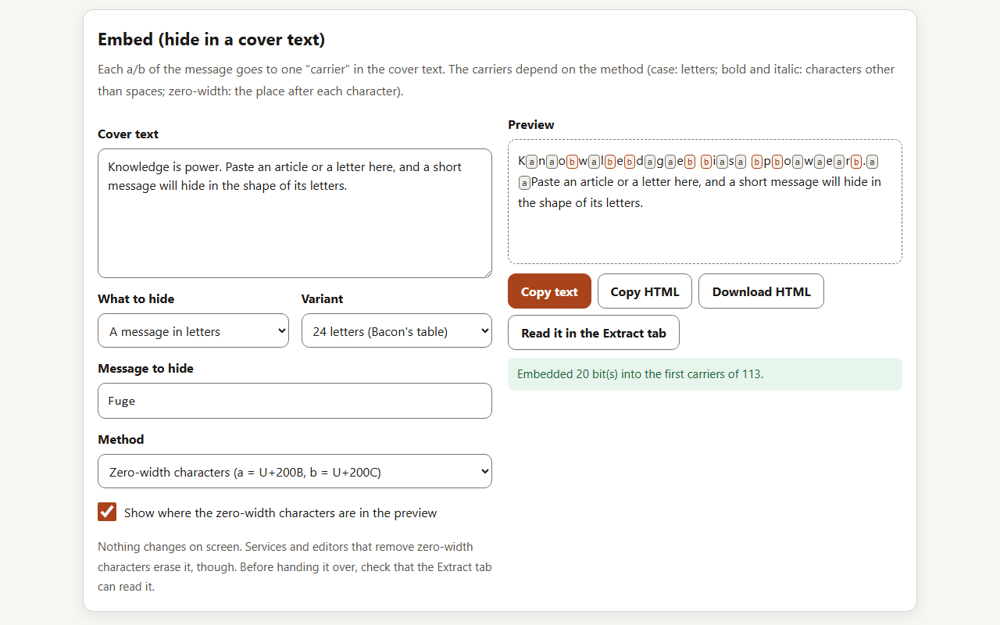
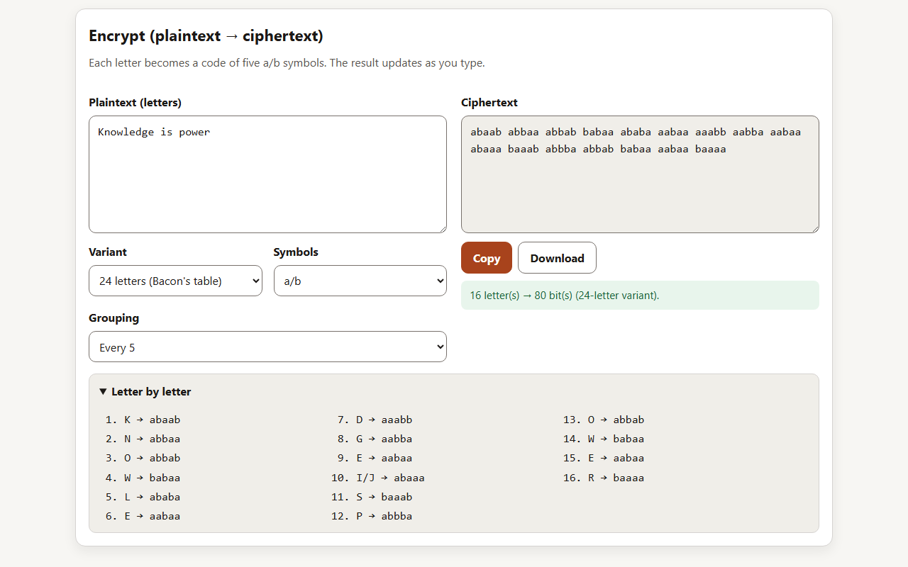
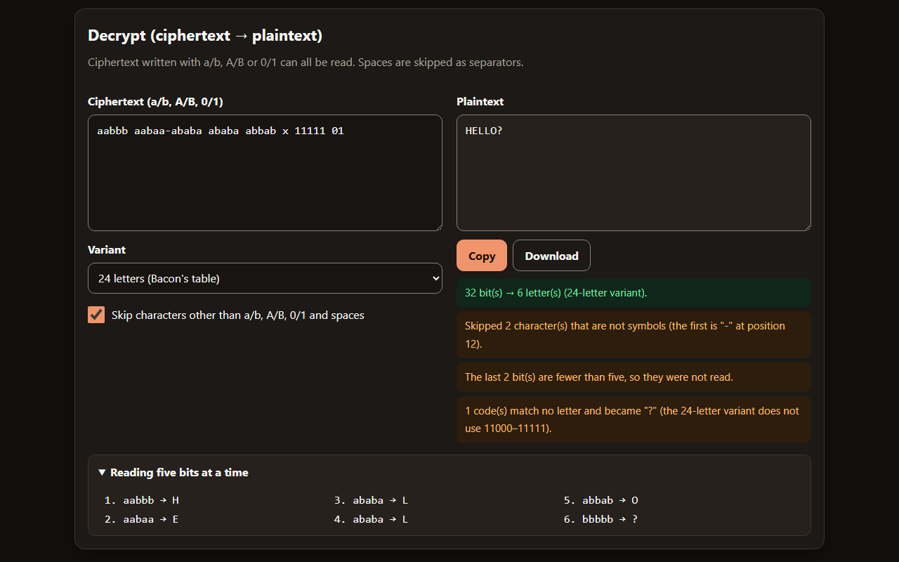
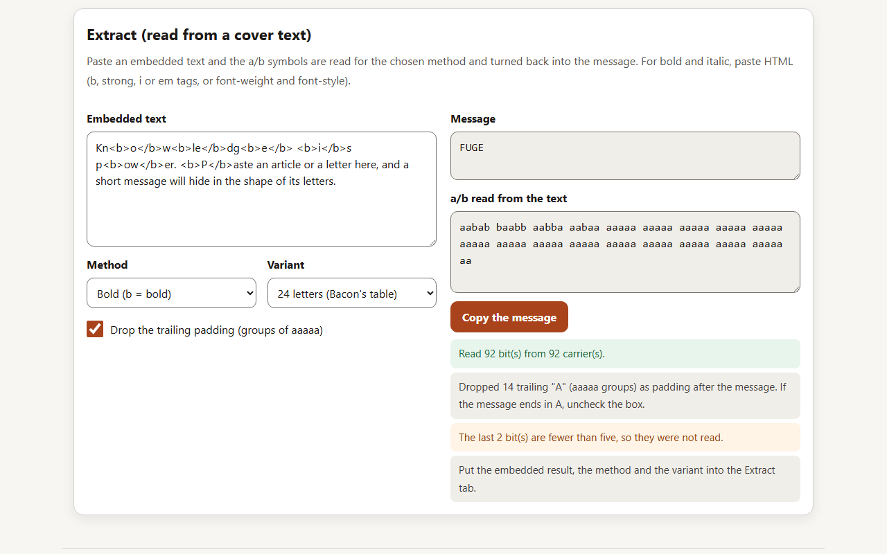
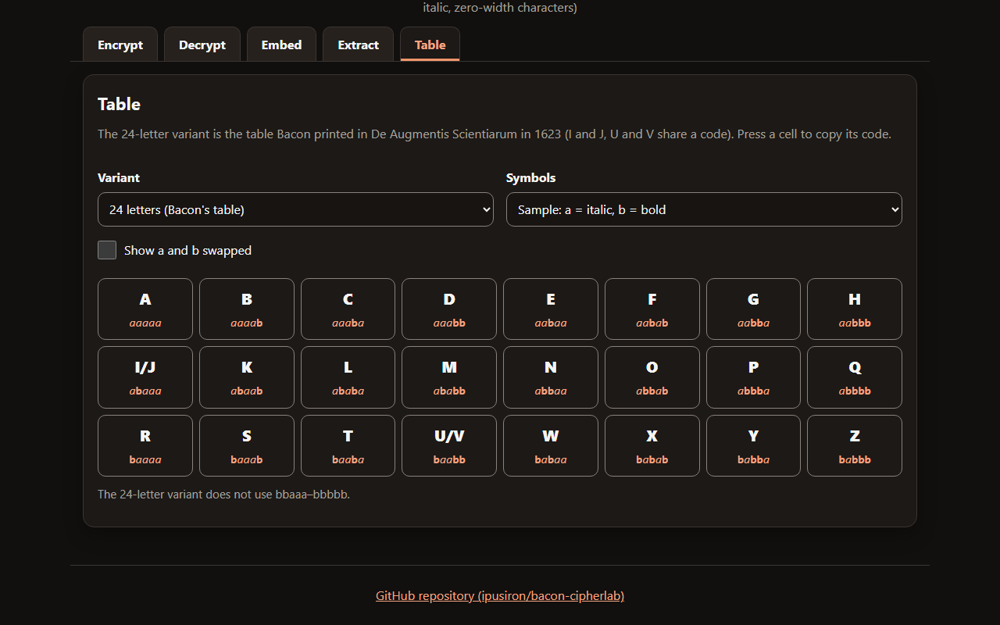
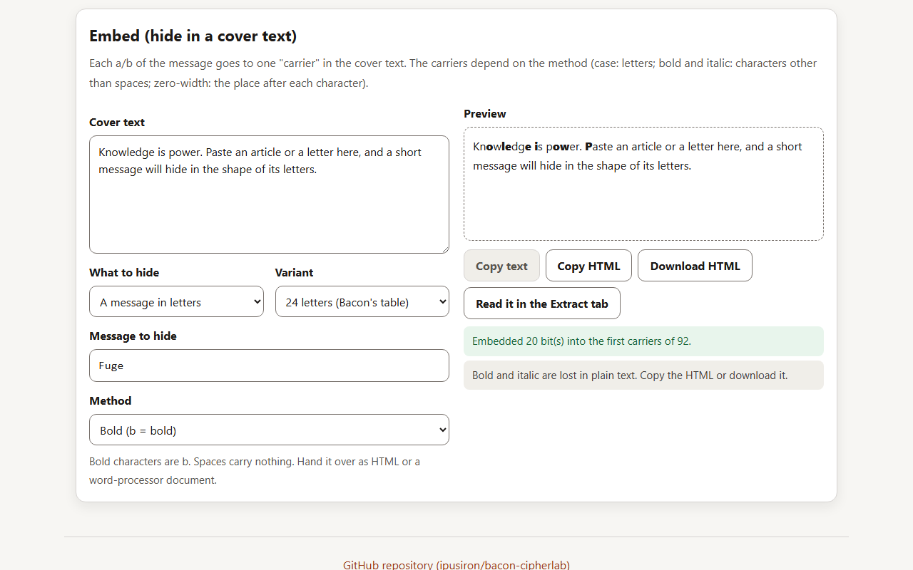

# 🥓 Bacon CipherLab - Interactive Bacon's Cipher Learning Tool

English · [日本語](README.md)


[](https://ipusiron.github.io/bacon-cipherlab/)

**Day055 - 100 Security Tools with Generative AI**

Bacon CipherLab is a tool for trying Bacon's cipher. Each letter becomes a code of five a/b symbols, and the sequence is then hidden in the shapes of the letters of a text (uppercase and lowercase, bold, italic) or in invisible zero-width characters. You can follow the whole round trip of conversion, embedding and extraction with both the 24-letter table Bacon published in 1623 and the later 26-letter variant. Nothing is sent over the network.

---

## 🌐 Demo

👉 **[https://ipusiron.github.io/bacon-cipherlab/](https://ipusiron.github.io/bacon-cipherlab/)**

Try it directly in your browser.

---

## 📸 Screenshots

>
>
>*Embedding with zero-width characters, with their positions shown*

>
>
>*The Encrypt tab and the letter-by-letter view*

>
>
>*Notes in the Decrypt tab (dark mode)*

>
>
>*The Extract tab reading a message from bold HTML*

>
>
>*The 24-letter table (dark mode)*

>
>
>*Preview of a message embedded in bold*

---

## 🥓 What is Bacon's cipher?

In The Advancement of Learning (1605), Francis Bacon (1561–1626) named three virtues of ciphers.

- They are not laborious to write and read
- They are impossible to decipher
- In some cases, they are without suspicion

He set out the method itself, with a table and an example, in Book VI, Chapter 1 of the Latin De Augmentis Scientiarum (1623). Bacon wrote that he devised it in his youth, when he was in Paris. Gilbert Wats's English translation followed in 1640; the figure below shows the table printed there.

>
>
>*Bacon's table in the 1640 English translation (p. 266)*

The 24 letters each get a code of five a/b symbols. I and J, and U and V, count as one letter; the table writes them as I and V.

To hide the codes in a text, you prepare a "Bi-formed Alphabet", in which every letter can be written in two forms (an a-form and a b-form). You then choose the form of each letter of the visible text (the exterior letter) to match the a/b symbols of the hidden text (the interior letter). Bacon's example hides Fuge ("flee") in Manere te volo donec venero ("I want you to stay until I come").

>
>
>*Bacon's example (Fuge fitted to the exterior letter, p. 268)*

The symbols for F, V, G and E (aabab, baabb, aabba, aabaa) go one by one onto the letters of the exterior letter. Bacon wrote that the exterior letter is five times as long as the interior one, and that no other condition is needed. He also wrote that anything with a twofold difference will do, such as bells, trumpets, lights and torches, or the report of muskets.

The case, bold and italic methods of this tool are an easy modern version of the bi-formed alphabet. The 26-letter variant (A = aaaaa to Z = bbaab), which gives every letter its own code, is a later variant and not Bacon's own table.

---

## ✨ Features

### Encrypt

- Replaces each letter with a five-symbol code, written as a/b, A/B or 0/1, grouped every 5, every 10 or not at all
- Reads full-width letters as ASCII letters. Leaves out everything else (digits, symbols, non-Latin text) and says how many were left out
- In the 24-letter variant, gives J the code of I and V the code of U, and says how many were replaced
- Updates the result as you type. A letter-by-letter view is available

### Decrypt

- Reads ciphertext written with a/b, A/B or 0/1. Spaces are skipped as separators
- Other characters are either skipped, or reading stops and the position of the first one is shown
- Reports trailing bits that are fewer than five, and codes that match no letter (shown as "?")

### Embed

- Hides the a/b symbols of a message in a cover text with four methods (case, bold, italic, zero-width characters)
- Shows how many carriers are needed and how many the cover text has
- With the case method, makes letters after the message lowercase (a); this can be turned off
- For zero-width characters, the preview can show where each one went. Emoji and combining characters stay intact
- Copy as text or HTML, or download the HTML. "Read it in the Extract tab" checks the round trip

### Extract

- Reads case and zero-width characters from text, and bold and italic from HTML (including the way Word and Google Docs write it)
- Drops the trailing padding (groups of aaaaa) and says how many letters were dropped
- Reports zero-width characters this tool does not use (ZWJ, WORD JOINER, BOM), if any

### Table

- Tables for the 24-letter and 26-letter variants. Switch the symbols, swap a and b, and press a cell to copy its code
- Shows the codes that match no letter (11000–11111 in the 24-letter variant, 11010–11111 in the 26-letter variant)

### Common

- Switch between Japanese and English (or open with `?lang=en`), and between light and dark
- Works with the keyboard (arrow keys, Home and End move between tabs) and with screen readers
- Sends nothing over the network. Only the language and theme choices are saved

---

## 📖 How to use

1. Type plaintext (letters) in the Encrypt tab and the ciphertext appears. Choose the variant (24 or 26 letters) and the symbols
2. Type ciphertext in the Decrypt tab and the plaintext comes back
3. In the Embed tab, type a cover text and the message to hide, and choose a method. Check the preview and the notes to see that it worked
4. Press "Read it in the Extract tab" to put the result into the Extract tab and see that it turns back into the message
5. Hand over text embedded in bold or italic as copied HTML or a downloaded file. Case and zero-width characters can be copied as plain text
6. Paste a text you received into the Extract tab and read it with the same method and variant used for embedding

---

## 🔬 Technical notes

### Code table

| Letter | 24 letters | 26 letters |
|---|---|---|
| A | aaaaa | aaaaa |
| B | aaaab | aaaab |
| C | aaaba | aaaba |
| D | aaabb | aaabb |
| E | aabaa | aabaa |
| F | aabab | aabab |
| G | aabba | aabba |
| H | aabbb | aabbb |
| I | abaaa | abaaa |
| J | abaaa (same as I) | abaab |
| K | abaab | ababa |
| L | ababa | ababb |
| M | ababb | abbaa |
| N | abbaa | abbab |
| O | abbab | abbba |
| P | abbba | abbbb |
| Q | abbbb | baaaa |
| R | baaaa | baaab |
| S | baaab | baaba |
| T | baaba | baabb |
| U | baabb | babaa |
| V | baabb (same as U) | babab |
| W | babaa | babba |
| X | babab | babbb |
| Y | babba | bbaaa |
| Z | babbb | bbaab |

In the 24-letter variant, J has the same code as I, and V the same code as U. When written with 0/1, a = 0 and b = 1.

### Examples

| Plaintext | 24 letters | 26 letters |
|---|---|---|
| HELLO | `aabbb aabaa ababa ababa abbab` | `aabbb aabaa ababb ababb abbba` |
| SOS | `baaab abbab baaab` | `baaba abbba baaba` |
| Fuge | `aabab baabb aabba aabaa` | `aabab babaa aabba aabaa` |

### Methods and carriers

| Method | a | b | Carrier | Where it tends to survive | What removes it |
|---|---|---|---|---|---|
| Case | Lowercase | Uppercase | Letters (A–Z, a–z) | Plain text in general | Processing that normalizes case |
| Bold | Normal | Bold | Characters other than spaces | HTML and word-processor documents | Copying as plain text |
| Italic | Normal | Italic | Characters other than spaces | HTML and word-processor documents | Copying as plain text |
| Zero-width characters | U+200B | U+200C | The place after each character | Most plain text | Processing that removes zero-width characters |

Each carrier carries one bit. A letter needs five carriers, so the cover text needs at least five times as many carriers as the letters to hide. For bold, italic and zero-width characters, characters are counted as graphemes (what looks like one character, including emoji sequences and combining characters). Bold spaces are invisible, so spaces are not used as carriers.

### End of the message

Bacon's cipher has no symbol for the end of a message. If the cover text is longer than the message, the carriers after it are read as well. So embedding sets the carriers after the message to a (lowercase for case; bold and italic simply stay normal), and extraction drops trailing "all a" groups (the letter A) as padding. If the message ends in A, uncheck the box in the Extract tab to keep them. Trailing bits fewer than five are not read.

### How bold and italic HTML is read

- Bold: `b` and `strong` tags, `class="bacon-bold"`, and `font-weight` of `bold`, `bolder` or 600 and above
- Italic: `i` and `em` tags, `class="bacon-italic"`, and `font-style` of `italic` or `oblique`
- `font-weight: normal` or `font-style: normal` inside turns it back to normal (Google Docs wraps everything in `<b style="font-weight:normal">`)
- Declarations with other names such as `mso-bidi-font-weight` are ignored (Word writes them)
- The contents of `script`, `style` and similar elements, and comments, are not read. Character references such as `&amp;` become characters

HTML is parsed by reading its tokens in the core, not by the browser's HTML parser, because letting the browser parse `style` attributes under the CSP reports violations.

### Zero-width characters

U+200B (ZERO WIDTH SPACE) and U+200C (ZERO WIDTH NON-JOINER) are both format characters (General Category Cf) that are normally not displayed (Default_Ignorable_Code_Point). They are not always invisible, though. Editors that show hidden characters display them, and U+200C breaks joining and ligatures in scripts such as Arabic. In justified text, the spacing may also change. The NFKC_CF normalization of Unicode removes them.

---

## 🪦 The Friedmans' gravestone

The gravestone of the American cryptologist William F. Friedman and his wife Elizebeth (Arlington National Cemetery) reads KNOWLEDGE IS POWER. The letters are cut in two typefaces, with and without serifs.


Make the letters with serifs uppercase and the others lowercase (following Elonka Dunin, the Os are treated as having serifs).

```text
KnOwledGe Is pOwEr
```

Take uppercase as b and lowercase as a, and split into groups of five.

```text
KnOwl edGeI spOwE r
babaa aabab aabab a
```

Read with the 24-letter variant (Bacon's table), this gives WFF, William F. Friedman's initials. The final a is padding. Read with the 26-letter variant, it gives UFF, which are not his initials. Whether the Os have serifs is debatable, but Elonka Dunin cites a note from Elizebeth to William's biographer R. Clark (in the papers at the Marshall Library) saying that WFF was the intended text.

In this tool, set the method to "Case" and the variant to "24 letters" in the Extract tab and paste `KnOwledGe Is pOwEr` to get WFF.

The photo is "ANCExplorer William F. Friedman grave" on Wikimedia Commons (public domain).

---

## 🎯 Use cases

### Classes and self-study

- Show the step that turns letters into codes (substitution) apart from the step that hides the codes in a text (concealment), to explain the difference between cryptography and steganography
- Follow Bacon's Fuge example and the Friedmans' gravestone in the Encrypt and Extract tabs
- Use it as an introduction to binary numbers: five bits give 32 patterns, enough for both 24 and 26 letters, as the table shows

### Setting and solving CTF challenges

This kind of challenge hides the answer in the case of the letters of the text. The text below hides THE FLAG IS BACON with the case method and the 24-letter variant.

```text
WelCome TO Our CompaNy HoMePage. we are COmmItteD to eXcellEnce in eveRytHInG wE Do, building practical solutions for complex problems across the globe.
```

→ `THEFLAGISBACON` (case, 24 letters)

- When solving, look for anything that comes in two kinds: uppercase and lowercase, bold and normal, two kinds of symbols
- Try both the 24-letter and 26-letter variants, and also try swapping a and b
- `{}` and digits cannot be written in Bacon's cipher, so when setting a challenge, state the flag format separately in the text

### Scenario 1: hiding in an article (fictional example)

A fictional scenario: someone in a censored place passes on a meeting time disguised as an ordinary article. The case method hides MEET AT NOON.

```text
cOnSTruCtion WorK in The city Is gOinG Well TOdAy. MAnY wORkers are busy at the new bridge, and good weather is expected for tomorrow.
```

→ `MEETATNOON` (case, 24 letters)

Capitals in the middle of sentences look unnatural, so a careful censor would notice. As with Bacon's bi-formed alphabet, the smaller the difference in shape, the less suspicion it raises.

### Scenario 2: hiding in a post with zero-width characters (fictional example)

The post looks ordinary, but zero-width characters after its letters hide HELP. The block below really contains zero-width characters.

```text
L​o​v‌e‌l‌y​ ​w‌e​a​t​h‌e​r‌ ​t​o‌d‌a‌y​. Fancy a walk in the park?
```

→ `HELP` (zero-width characters, 24 letters)

If the service where it is posted removes zero-width characters, the message disappears too. Before handing it over, check that the Extract tab can read it.

### Other uses

- Puzzles for escape rooms and puzzle events (the case of letters on a poster, letters in two colors)
- A marker for telling copies apart: give each copy of a document a different sequence and see which one got out
- Two-way signals (blinking lights, long and short sounds, beads or stitches in two colors). Bacon himself mentions bells, trumpets and lights
- Practice in telling typefaces apart (serif and sans-serif, roman and italic)

### From the finder's side

- Check whether letter case switches more often than in ordinary text
- Check for zero-width characters. [WeirdString Inspector](https://ipusiron.github.io/weirdstring-inspector/) (Day023) lists invisible characters
- Check whether bold or italic is scattered without regard to meaning

---

## 📊 Comparison with other classical ciphers

| Item | Bacon's cipher | Caesar cipher | Vigenère cipher | Playfair cipher |
|---|---|---|---|---|
| Date | Table published in 1623 | 1st century BC (recorded by Suetonius) | Described by Bellaso in 1553 | Devised by Wheatstone in 1854 |
| Type | Substitution + steganography | Monoalphabetic substitution (fixed shift) | Polyalphabetic substitution (repeating key) | Digraph substitution (5×5 square) |
| Aim of secrecy | Not letting anyone notice a cipher is in use | Making the text unreadable | Resisting frequency analysis | Resisting frequency analysis |
| Security | Low (once the five-symbol groups are taken out, it is monoalphabetic substitution), but hard to notice | Very low (only 25 shifts) | No solution was published until Kasiski published a general attack in 1863 | Mauborgne published a solution in 1914 |
| Tool in this project | [Bacon CipherLab](https://ipusiron.github.io/bacon-cipherlab/) | [Caesar Cipher Wheel](https://ipusiron.github.io/caesar-cipher-wheel/) | [Vigenere Cipher Tool](https://ipusiron.github.io/vigenere-cipher-tool/) | [Playfair CipherLab](https://ipusiron.github.io/playfair-cipherlab/) |

---

## 🔒 Security

- Everything runs in the browser, and nothing is sent over the network
- The CSP is `default-src 'self'; script-src 'self'; style-src 'self'; img-src 'self' data:; connect-src 'none'; object-src 'none'; base-uri 'none'; form-action 'none'`
- All text on the page is shown with `textContent` and built elements; `innerHTML` is not used. Pasted HTML is read token by token without being put into the DOM
- The downloaded HTML contains only the embedded text, with no scripts
- `localStorage` holds only the language and theme choices, and the page works where it is unavailable

---

## ⚠️ Notes and limitations

- Bacon's cipher is a classical cipher with no key. Anyone who takes out the codes can read them, so it cannot protect secrets
- Hiding only makes the message harder to notice. Unnatural case, scattered bold or italic, and the presence of zero-width characters give it away
- Bold and italic survive only in HTML and word-processor documents. Zero-width characters disappear when a service or editor removes them
- Extraction drops trailing "all a" groups as padding. If the message ends in A, uncheck the box to keep them
- Characters other than letters (digits, symbols, non-Latin text) cannot be encrypted
- Each field accepts up to 100,000 characters
- The author does not encourage uses that deceive or harm people

---

## 🧪 Tests

```bash
npm test
```

- Runs with `node --test` on Node.js 22 or later, with no dependencies (no `npm install` needed)
- Runs on GitHub Actions for every push and pull request
- `test/core.test.js`: the 24 rows of Bacon's original table and the 26-letter table, known answers for Fuge, HELLO, SOS and the gravestone, notes from decryption, round trips for 4 methods × 2 variants, intact emoji, and reading HTML tokens
- `test/html.test.js`, `test/contrast.test.js`, `test/messages.test.js`, `test/i18n.test.js`, `test/format.test.js`: the CSP, tab ARIA, dictionary and page text, color contrast (4.5:1 and 3:1), and formatting
- `test/readme.test.js`: checks the README's code table, examples, gravestone and use cases against the core, and the headings, images and directory structure of the Japanese and English READMEs

---

## 🔗 References

- [Francis Bacon, The Advancement of Learning (transcription of the 1605 first edition, EEBO-TCP A01516)](https://github.com/textcreationpartnership/A01516)
- [Francis Bacon, The Advancement of Learning (Project Gutenberg #5500)](https://www.gutenberg.org/ebooks/5500)
- [Francis Bacon, De Dignitate et Augmentis Scientiarum (1623, Internet Archive)](https://archive.org/details/aoperafranciscib00baco)
- [Francis Bacon, Of the Advancement and Proficience of Learning (1640, Internet Archive)](https://archive.org/details/ofadvancementp00baco)
- [Francis Bacon, Of the Advancement and Proficience of Learning (transcription of 1640, EEBO-TCP A72146)](https://github.com/textcreationpartnership/A72146)
- [Stanford Encyclopedia of Philosophy, "Francis Bacon"](https://plato.stanford.edu/entries/francis-bacon/)
- [Elonka Dunin, "Cipher on the William and Elizebeth Friedman tombstone"](https://elonka.com/friedman/)
- [Wikimedia Commons, "ANCExplorer William F. Friedman grave"](https://commons.wikimedia.org/wiki/File:ANCExplorer_William_F._Friedman_grave.jpg)
- [Unicode Character Database 18.0.0](https://www.unicode.org/Public/18.0.0/ucd/)
- [The Unicode Standard, Version 18.0 Core Specification](https://www.unicode.org/versions/Unicode18.0.0/core-spec/)
- [W3C, "Content Security Policy Level 3"](https://www.w3.org/TR/CSP3/)
- [WHATWG HTML Standard, "Pragma directives"](https://html.spec.whatwg.org/multipage/semantics.html#pragma-directives)
- [CyberChef (Bacon.mjs)](https://github.com/gchq/CyberChef/blob/master/src/core/lib/Bacon.mjs)
- [dCode, "Bacon Cipher"](https://www.dcode.fr/bacon-cipher)

---

## 📁 Directory structure

```text
bacon-cipherlab/
├── .github/                       # GitHub settings
│   └── workflows/                 # GitHub Actions workflows
│       └── test.yml               # Runs npm test on push and pull request
├── assets/                        # Images for the README
│   ├── en/                        # Screenshots of the English page
│   │   ├── screenshot.png         # Embedding with zero-width characters (English)
│   │   ├── screenshot2.png        # Encrypt tab (English)
│   │   ├── screenshot3.png        # Notes in the Decrypt tab (English, dark)
│   │   ├── screenshot4.png        # Extracting from bold HTML (English)
│   │   ├── screenshot5.png        # Table (English, dark)
│   │   └── screenshot6.png        # Embedding in bold (English)
│   ├── bacon-1640-accommodation.jpg # Bacon's example (1640 translation, p. 268)
│   ├── bacon-1640-table.jpg       # Bacon's table (1640 translation, p. 266)
│   ├── screenshot.png             # Embedding with zero-width characters
│   ├── screenshot2.png            # Encrypt tab
│   ├── screenshot3.png            # Notes in the Decrypt tab (dark)
│   ├── screenshot4.png            # Extracting from bold HTML
│   ├── screenshot5.png            # Table (dark)
│   └── screenshot6.png            # Embedding in bold
├── js/                            # Scripts loaded by the page
│   ├── bacon-core.js              # Core (tables, encryption, decryption, embedding, extraction, HTML token reading)
│   ├── i18n.js                    # Language choice and replacement of text in the HTML
│   ├── messages.js                # Japanese and English text
│   ├── theme-init.js              # Applies the saved theme before drawing
│   └── theme.js                   # Light and dark switch
├── test/                          # Automated tests (node --test)
│   ├── contrast.test.js           # Color contrast and size of controls
│   ├── core.test.js               # Core
│   ├── format.test.js             # Line length, line endings, control characters
│   ├── html.test.js               # CSP, tab ARIA, text and HTML match
│   ├── i18n.test.js               # How the language is chosen
│   ├── load.js                    # Loads the page's scripts into the tests
│   ├── messages.test.js           # Japanese and English dictionaries
│   └── readme.test.js             # README tables, examples, headings, images, directory structure
├── .gitignore                     # Files kept out of Git
├── .nojekyll                      # Turns off Jekyll on GitHub Pages
├── CLAUDE.md                      # Notes for development (for Claude Code)
├── LICENSE                        # MIT License
├── README.en.md                   # This file
├── README.md                      # Japanese README
├── index.html                     # Page
├── package.json                   # npm test definition (no dependencies)
├── script.js                      # Page logic
└── style.css                      # Styles (light and dark)
```

---

## 💻 Requirements

- A recent browser (checked with Chromium, Edge and Firefox; Safari not checked)
- Opening `index.html` directly works. To use a local HTTP server:

```bash
python -m http.server 8000
# open http://localhost:8000/
```

---

## 📄 License

MIT License - see [LICENSE](LICENSE).

---

## 🛠️ About this tool

This tool was built as part of the "100 Security Tools with Generative AI" project.
The project builds and publishes a wide range of security tools over 100 days with the help of AI.

For details and the other tools, see:

🔗 [https://akademeia.info/?page_id=42163](https://akademeia.info/?page_id=42163)
