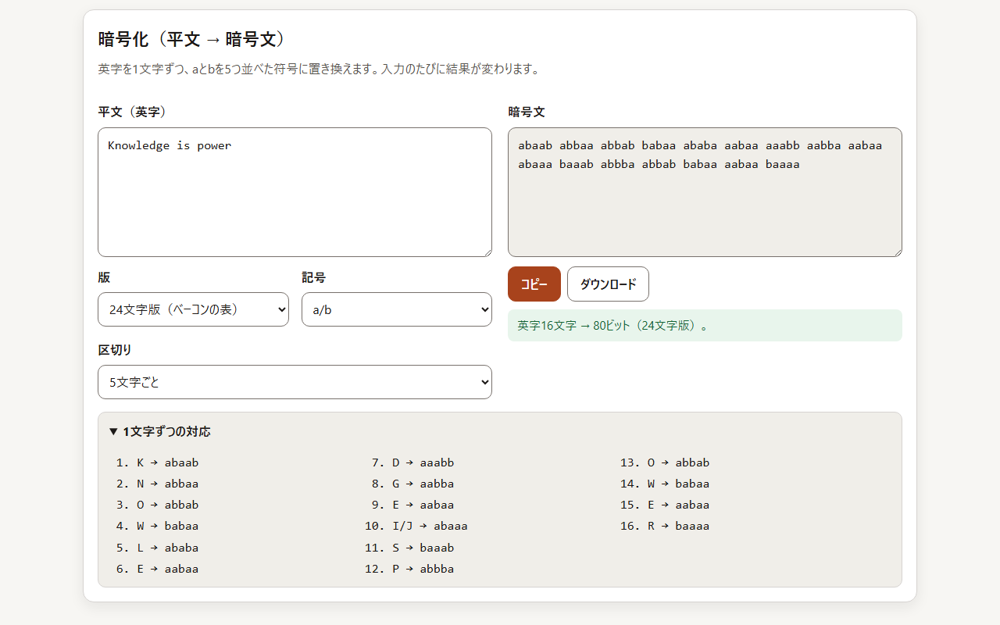
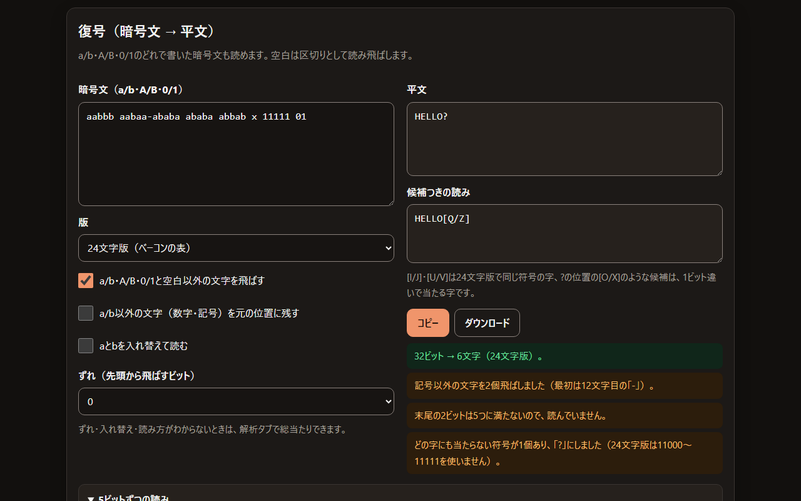
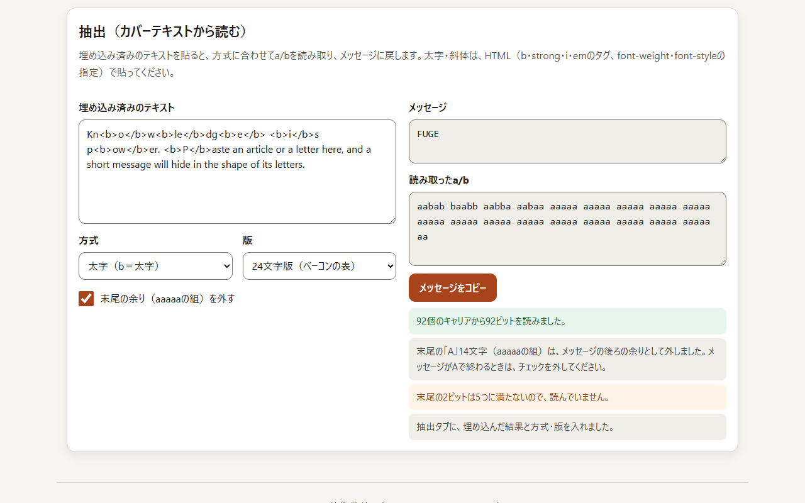
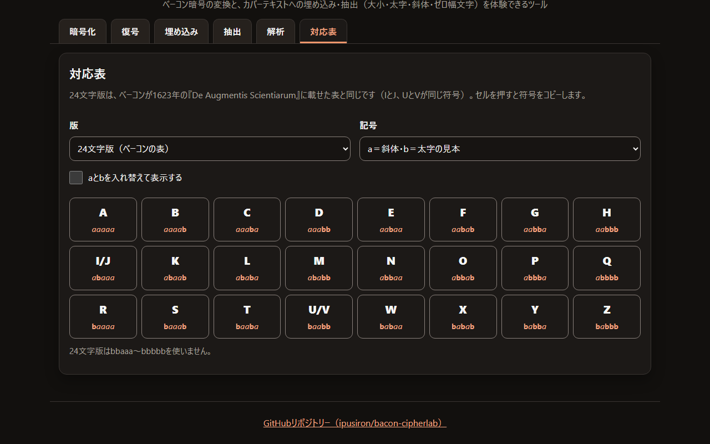
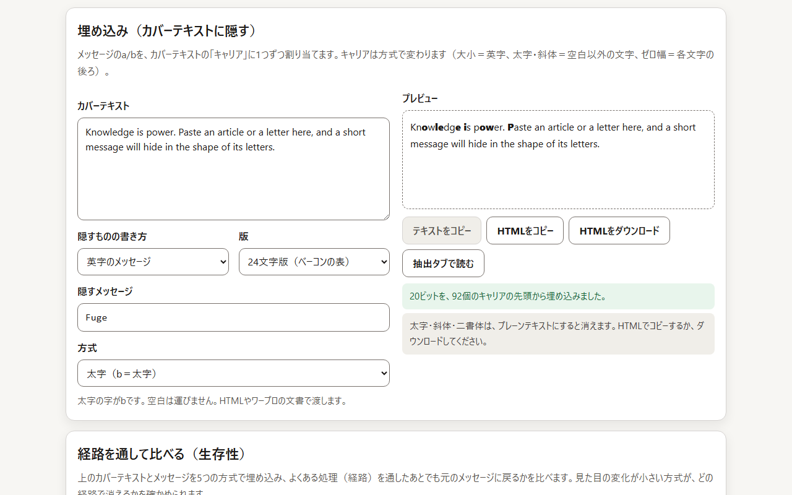
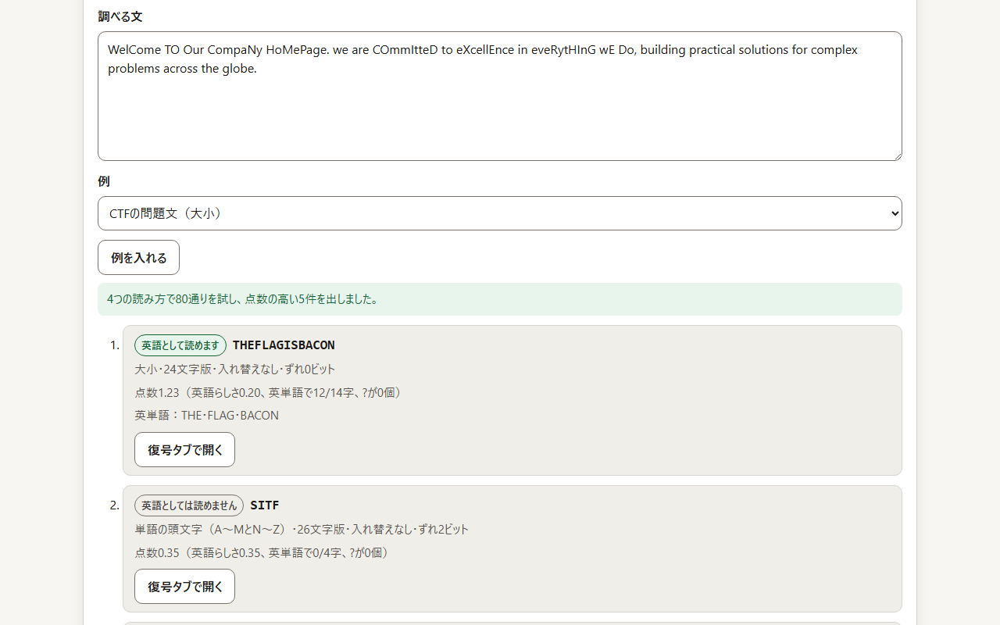
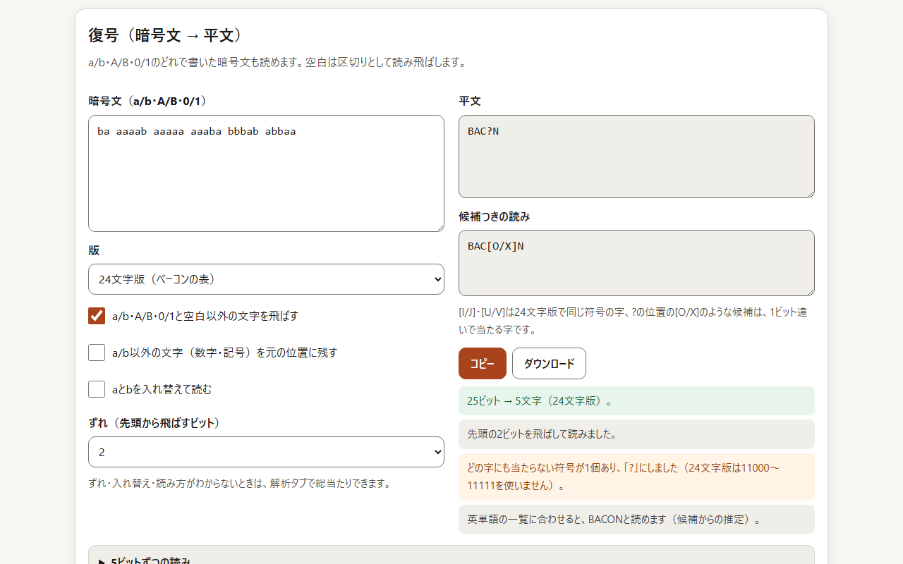
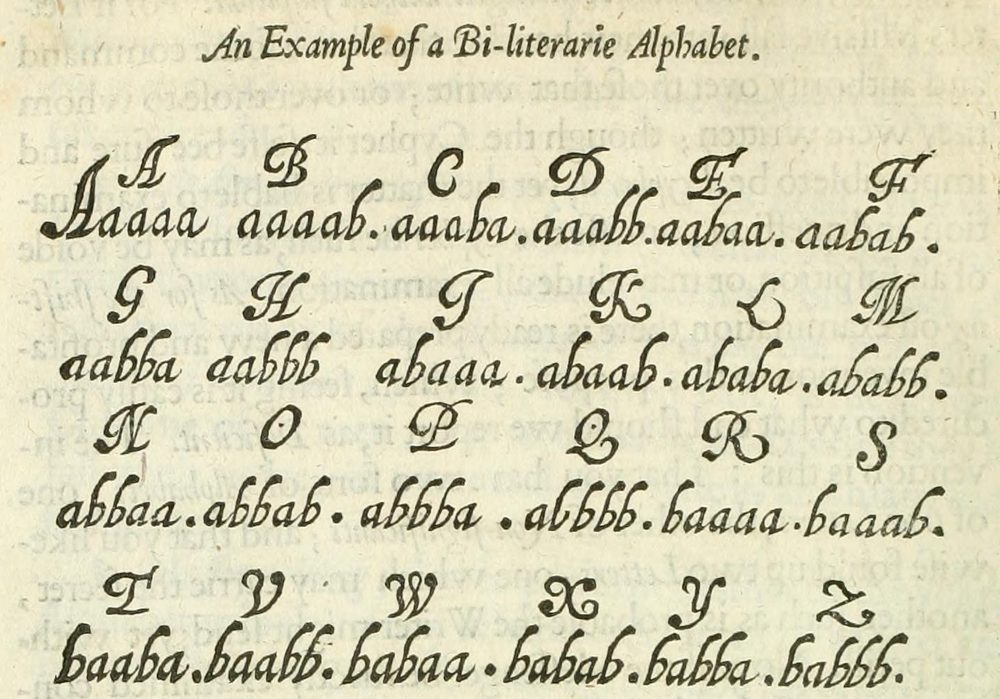
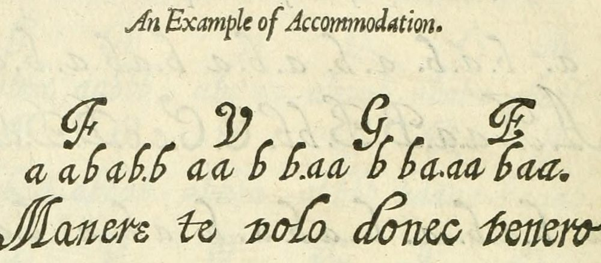

<!--
---
id: day055
slug: bacon-cipherlab

title: "Bacon CipherLab"

subtitle_ja: "ベーコン暗号の体験ツール"
subtitle_en: "Interactive Bacon's Cipher Learning Tool"

description_ja: "ベーコン暗号（Bacon's Cipher）を体験するツール。ベーコンが1623年に示した24文字の表と後世の26文字版で平文と暗号文を変換し、カバーテキストへの埋め込みと抽出（大小・太字・斜体・ゼロ幅文字）を通して、暗号を使っていると気づかせないステガノグラフィーの考え方を学べる。ネットワークへは何も送らない。"
description_en: "A tool for trying Bacon's cipher. Convert between plaintext and ciphertext with the 24-letter table Bacon published in 1623 or the later 26-letter variant, and hide and read messages in a cover text (case, bold, italic, zero-width characters) to learn the idea behind steganography: not letting anyone notice that a cipher is in use. Nothing is sent over the network."

category_ja:
  - 古典暗号
  - ステガノグラフィー
category_en:
  - Classical Cryptography
  - Steganography

difficulty: 2

tags:
  - bacon-cipher
  - classical-cryptography
  - steganography
  - zero-width-characters
  - cryptanalysis
  - education
  - web-tool
  - ctf

repo_url: "https://github.com/ipusiron/bacon-cipherlab"
demo_url: "https://ipusiron.github.io/bacon-cipherlab/"

hub: true
---
-->

# 🥓 Bacon CipherLab - ベーコン暗号の体験ツール

[English](README.en.md) · 日本語


[](https://ipusiron.github.io/bacon-cipherlab/)

**Day055 - 生成AIで作るセキュリティツール100**

Bacon CipherLabは、ベーコン暗号（Bacon's Cipher）を体験するツールです。英字を1文字ずつ、aとbを5つ並べた符号に置き換え、その並びを文の字の形（大文字・小文字、太字、斜体）や、見えないゼロ幅文字に移して隠します。ベーコンが1623年に示した24文字の表と、後世の26文字版の両方で、変換・埋め込み・抽出の往復をたどれます。ずれ・aとbの入れ替え・読み違いに強い復号と、読み方を総当たりする解析タブで、隠し方のわからない文も調べられます。ネットワークへは何も送りません。

---

## 🌐 デモページ

👉 **[https://ipusiron.github.io/bacon-cipherlab/](https://ipusiron.github.io/bacon-cipherlab/)**

ブラウザーで直接お試しいただけます。

---

## 📸 スクリーンショット

>
>
>*ゼロ幅文字で埋め込み、位置を表示した画面*

>
>
>*暗号化タブと1文字ずつの対応*

>
>
>*復号タブの知らせ（ダークモード）*

>
>
>*太字のHTMLからメッセージを読んだ抽出タブ*

>
>
>*24文字版の対応表（ダークモード）*

>
>
>*太字で埋め込んだプレビュー*

>
>
>*CTFの問題文を解析タブで総当たりした結果*

>
>
>*2ビットずれた暗号文を、ずれを指定して読んだ復号タブ*

---

## 🥓 ベーコン暗号とは

フランシス・ベーコン（1561〜1626年）は、1605年の『学問の進歩』（The Advancement of Learning）で、暗号の美点を3つ挙げました。

- 書くにも読むにも手間がかからない（not laborious to write and reade）
- 解読できない（impossible to discypher）
- 場合によっては、疑いを招かない（in some cases, without suspition）

この方式を表と例つきで示したのは、1623年のラテン語版『De Augmentis Scientiarum』第6巻第1章です。ベーコンは、若いころパリにいたときに考えたと書いています。1640年には、Gilbert Watsの英訳が出ました。下の図は、その英訳に載った表です。

>
>
>*1640年の英訳に載ったベーコンの表（p.266）*

24の字が、aとbを5つ並べた符号に並びます。IとJ、UとVは同じ字として扱い、表ではIとVの字で書いています。

符号を文に隠すには、どの字も2通りの形（a形とb形）で書ける「二形のアルファベット」（Bi-formed Alphabet）を用意し、隠したい文（内側の手紙）のaとbに合わせて、見せる文（外側の手紙）の字の形を1字ずつ選びます。ベーコンの例は、Fuge（逃げよ）を、Manere te volo donec venero（私が来るまでここにいてほしい）に隠すものです。

>
>
>*ベーコンの例（Fugeを外側の手紙に当てはめた図、p.268）*

F・V・G・Eのaabab・baabb・aabba・aabaaを、外側の手紙の字に1つずつ当てています。ベーコンは、外側の手紙は内側の手紙の5倍の長さになり、ほかに条件はないと書いています。さらに、2通りの違いさえあれば、鐘・ラッパ・灯火・銃声でも同じように伝えられるとも書いています。

このツールの大小・太字・斜体の方式は、二形のアルファベットを、いまの文字で手軽に再現するものです。26文字版（A＝aaaaa〜Z＝bbaab）は、すべての字に別の符号を当てる後世の変種で、ベーコン自身の表ではありません。

---

## ✨ 機能

### 暗号化

- 英字を5桁の符号に置き換える。記号はa/b・A/B・0/1、区切りは5文字ごと・10文字ごと・なしから選ぶ
- 全角の英字は半角として読む。英字以外（数字・記号・日本語）は外し、外した数を示す
- 24文字版ではJをI、VをUと同じ符号にし、置き換えた数を示す
- 入力のたびに結果を作り直す。1文字ずつの対応も表示できる

### 復号

- a/b・A/B・0/1のどれで書いた暗号文も読む。空白は区切りとして飛ばす
- ほかの文字は、飛ばすか、最初の1文字の位置を示して止めるかを選べる
- 5に満たない末尾のビットと、どの字にも当たらない符号（「?」にする）を知らせる
- ずれ（先頭から飛ばすビット、0〜4）と、aとbの入れ替えを指定して読める
- a/b以外の文字（数字・記号）を元の位置に残して読める（`B4CON`のような旗の形式に使う）
- 候補つきの読みを示す。24文字版のIとUは[I/J]・[U/V]、「?」は1ビット違いで当たる字の候補（例: [O/X]）
- 英単語の一覧に合わせて、JやVと「?」を補った読みを示す（例: ILOUEBACON → ILOVEBACON、BAC?N → BACON）

### 埋め込み

- 4つの方式（大小・太字・斜体・ゼロ幅文字）で、メッセージのaとbをカバーテキストに隠す
- 必要なキャリアの数と、カバーテキストにある数を示す
- 大小の方式では、メッセージより後ろの英字を小文字（a）にそろえる（外せる）
- ゼロ幅文字は、文字の後ろのどこに入れたかをプレビューに表示できる。絵文字や結合文字を壊さない
- テキスト・HTMLのコピーとHTMLのダウンロード。「抽出タブで読む」で往復を確かめられる

### 抽出

- 大小・ゼロ幅文字はテキストから、太字・斜体はHTMLから読む（WordやGoogleドキュメントの書き方も読む）
- 末尾の余り（aaaaaの組）を外し、外した数を示す
- このツールが使わないゼロ幅の文字（ZWJ・WORD JOINER・BOM）があれば、その数を示す

### 解析

- 貼った文から、2通りに分かれるものを読み方として取り出す（a/bの記号、大文字と小文字、A〜MとN〜Z、単語の頭文字、子音と母音、2種類だけの記号、太字・斜体、ゼロ幅文字）
- 読み方×版（24文字・26文字）×aとbの入れ替え×ずれ（0〜4ビット）を総当たりし、点数の高い5件を、読み方・版・ずれ・点数の内訳つきで並べる
- 候補から「復号タブで開く」で、その暗号文と設定を復号タブに入れて確かめられる
- 例（CTFの問題文、2ビットずれた暗号文、絵文字2種類、単語の頭文字、ゼロ幅文字）を画面から入れられる

### 対応表

- 24文字版・26文字版の表。記号の切り替え、aとbの入れ替え、セルを押して符号をコピーできる
- どの字にも当たらない符号（24文字版は11000〜11111、26文字版は11010〜11111）を示す

### 共通

- 日本語・英語の切り替え（`?lang=en`でも開ける）と、ライト・ダークの切り替え
- キーボード（タブは矢印キー・Home・End）とスクリーンリーダーで使える
- ネットワークへは何も送らない。保存するのは言語とテーマの選択だけ

---

## 📖 使い方

1. 暗号化タブに平文（英字）を入れると、暗号文が出る。版（24文字版・26文字版）と記号を選ぶ
2. 復号タブに暗号文を入れると、平文に戻る
3. 埋め込みタブで、カバーテキストと隠すメッセージを入れ、方式を選ぶ。プレビューと知らせで、埋め込めたかを確かめる
4. 「抽出タブで読む」を押すと、埋め込んだ結果が抽出タブに入り、メッセージに戻ることを確かめられる
5. 太字・斜体で埋め込んだ文は、HTMLでコピーするかダウンロードして渡す。大小とゼロ幅文字は、テキストのままコピーできる
6. 受け取った文は、抽出タブに貼り、埋め込みと同じ方式と版を選んで読む
7. 隠し方がわからない文は、解析タブに貼る。上位の候補の「復号タブで開く」で、ずれや入れ替えを確かめる

---

## 🔬 技術的な説明

### 対応表

| 字 | 24文字版 | 26文字版 |
|---|---|---|
| A | aaaaa | aaaaa |
| B | aaaab | aaaab |
| C | aaaba | aaaba |
| D | aaabb | aaabb |
| E | aabaa | aabaa |
| F | aabab | aabab |
| G | aabba | aabba |
| H | aabbb | aabbb |
| I | abaaa | abaaa |
| J | abaaa（Iと同じ） | abaab |
| K | abaab | ababa |
| L | ababa | ababb |
| M | ababb | abbaa |
| N | abbaa | abbab |
| O | abbab | abbba |
| P | abbba | abbbb |
| Q | abbbb | baaaa |
| R | baaaa | baaab |
| S | baaab | baaba |
| T | baaba | baabb |
| U | baabb | babaa |
| V | baabb（Uと同じ） | babab |
| W | babaa | babba |
| X | babab | babbb |
| Y | babba | bbaaa |
| Z | babbb | bbaab |

24文字版では、JはIと、VはUと同じ符号です。0/1で書くときは、a＝0、b＝1です。

### 変換の例

| 平文 | 24文字版 | 26文字版 |
|---|---|---|
| HELLO | `aabbb aabaa ababa ababa abbab` | `aabbb aabaa ababb ababb abbba` |
| SOS | `baaab abbab baaab` | `baaba abbba baaba` |
| Fuge | `aabab baabb aabba aabaa` | `aabab babaa aabba aabaa` |

### 方式とキャリア

| 方式 | a | b | キャリア | 残りやすいところ | 消えるところ |
|---|---|---|---|---|---|
| 大小 | 小文字 | 大文字 | 英字（A〜Z・a〜z） | プレーンテキスト全般 | 大文字・小文字をそろえる処理 |
| 太字 | 通常 | 太字 | 空白以外の文字 | HTML・ワープロの文書 | プレーンテキストへのコピー |
| 斜体 | 通常 | 斜体 | 空白以外の文字 | HTML・ワープロの文書 | プレーンテキストへのコピー |
| ゼロ幅文字 | U+200B | U+200C | 各文字の後ろ | 多くのプレーンテキスト | ゼロ幅文字を取り除く処理 |

1つのキャリアが1ビットを運びます。英字1字に5つのキャリアが要るので、カバーテキストには、隠す英字の5倍以上のキャリアが要ります。太字・斜体とゼロ幅文字では、文字を書記素（見た目の1文字。絵文字の並びや結合文字をまとめたもの）で数えます。太字の空白は見えないので、空白はキャリアにしません。

### メッセージの終わり

ベーコン暗号には、メッセージの終わりを示す記号がありません。カバーテキストがメッセージより長いと、後ろのキャリアも読まれます。そこで、埋め込みではメッセージより後ろのキャリアをaにそろえ（大小は小文字にし、太字・斜体は通常のままにする）、抽出では末尾の「全部aの組」（字のA）を余りとして外します。メッセージがAで終わるときは、抽出タブのチェックを外すと戻せます。5に満たない末尾のビットは読みません。

### 太字・斜体のHTMLの読み方

- 太字＝`b`・`strong`のタグ、`class="bacon-bold"`、`font-weight`の`bold`・`bolder`・600以上
- 斜体＝`i`・`em`のタグ、`class="bacon-italic"`、`font-style`の`italic`・`oblique`
- 内側で`font-weight: normal`や`font-style: normal`を指定すると、通常に戻る（Googleドキュメントは全体を`<b style="font-weight:normal">`で囲む）
- `mso-bidi-font-weight`のように名前の違う指定は見ない（Wordが書き出す）
- `script`・`style`などの中身とコメントは読まない。`&amp;`などの文字参照は文字に戻す

HTMLは、ブラウザーのHTML解析器ではなく、計算部の字句の読み取りで解析します。CSPの下で`style`属性をブラウザーに解析させると、違反が報告されるためです。

### ずれ・入れ替え・読み違いの候補

暗号文の先頭に余分なビットがあると、5ビットの区切りがずれて、別の字になります。復号タブの「ずれ」で、先頭から飛ばすビットの数（0〜4）を選べます。aとbの割り当てが逆のときは、入れ替えて読みます。

どの字にも当たらない符号（「?」）は、1ビットだけ読み違えた可能性があります。1ビット変えるとどれかの字に当たる符号を、候補として[O/X]のように示します。24文字版では、IとJ、UとVが同じ符号なので、IとUを[I/J]・[U/V]と示します。さらに、計算部に持つ英単語の一覧（204語）に合わせて、JやVと「?」を補った読みを示します。これは候補からの推定です。

「a/b以外の文字を元の位置に残す」では、記号以外の文字を、その前までに読んだ字の後ろに置きます。a/bの字で書いた暗号文では、数字の0と1も記号ではなく残す文字として扱います。

### 解析の読み方と点数

| 読み方 | aになるもの | bになるもの | 取り出す対象 |
|---|---|---|---|
| a/b・A/B・0/1の記号 | a・A・0 | b・B・1 | 空白以外の8割以上が記号の文 |
| 大小 | 小文字 | 大文字 | 英字 |
| A〜MとN〜Z（各英字） | A〜M | N〜Z | 英字（大文字・小文字を問わない） |
| 単語の頭文字（A〜MとN〜Z） | A〜Mで始まる語 | N〜Zで始まる語 | 空白で区切った語の最初の英字 |
| 子音と母音 | 子音 | 母音（A・E・I・O・U） | 英字 |
| 2種類の記号 | 先に出た記号 | もう一方の記号 | 空白以外が2種類だけの文（書記素で数える） |
| 太字 | 通常 | 太字 | HTMLの空白以外の文字 |
| 斜体 | 通常 | 斜体 | HTMLの空白以外の文字 |
| ゼロ幅文字 | U+200B | U+200C | ゼロ幅文字 |

入れ替えも総当たりするので、ほかの読み方のaとbを入れ替えただけの読み方は除きます。各読み方を、24文字版・26文字版、入れ替えの有無、ずれ0〜4ビットで読み、末尾の余り（aaaaaの組）を外してから点数を付けます。

点数は、英語らしさ＋1.2×（英単語で覆える字の割合）−2×（「?」の割合）−（1つの字への偏り）で求めます。英語らしさは、英語の文字の出現頻度（Wikipediaの「Letter frequency」の表。出典はLewandの2000年の本）による1文字あたりの対数尤度を、一様分布と比べた値です。1つの字への偏りは、6字以上の読みで、いちばん多い字が3割を超えた分を4倍して引きます。4字未満の読みは1を引きます。点数が1以上なら「英語として読めます」、0.5以上なら「読めるかもしれません」と表示します。

| 例 | 1位の読み | 読み方 | 版 | ずれ |
|---|---|---|---|---|
| CTFの問題文（大小） | `THEFLAGISBACON` | 大小 | 24文字版 | 0 |
| 2ビットずれた暗号文 | `ATTACKATDAWN` | a/b・A/B・0/1の記号 | 24文字版 | 2 |
| 絵文字2種類 | `BACONANDEGGS` | 2種類の記号 | 26文字版 | 0 |
| 単語の頭文字（A〜MとN〜Z） | `STOP` | 単語の頭文字（A〜MとN〜Z） | 24文字版 | 0 |
| ゼロ幅文字 | `MEETATNOON` | ゼロ幅文字 | 24文字版 | 0 |

### ゼロ幅文字

U+200B（ZERO WIDTH SPACE）とU+200C（ZERO WIDTH NON-JOINER）は、どちらも書式の文字（一般カテゴリCf）で、ふつうは表示しない文字（Default_Ignorable_Code_Point）です。ただし、いつでも見えないわけではありません。隠し文字を表示するエディターでは見えますし、U+200Cはアラビア文字などのつながりや合字を断ちます。両端揃えの文では、字間が空くこともあります。Unicodeの正規化のNFKC_CFを通すと消えます。

---

## 🪦 フリードマン夫妻の墓碑

アメリカの暗号研究者ウィリアム・F・フリードマンと妻エリザベスの墓石（アーリントン国立墓地）には、KNOWLEDGE IS POWERと刻まれています。この字は、セリフのある字とない字の2つの書体で彫り分けられています。


セリフのある字を大文字、ない字を小文字にすると、次のようになります（Elonka Duninの説明に従い、Oはセリフのある字として扱います）。

```text
KnOwledGe Is pOwEr
```

大文字をb、小文字をaとして、5文字ずつに区切ります。

```text
KnOwl edGeI spOwE r
babaa aabab aabab a
```

24文字版（ベーコンの表）で読むとWFF、つまりウィリアム・F・フリードマンの頭文字になります。最後のaは余りです。26文字版で読むとUFFになり、頭文字になりません。Oにセリフがあるかは判断が分かれますが、Elonka Duninは、エリザベスがウィリアムの伝記作家R. Clarkに宛てたメモ（マーシャル図書館の資料）を挙げ、意図した文がWFFだったと説明しています。

このツールでは、抽出タブで方式を「大小」、版を「24文字版」にして`KnOwledGe Is pOwEr`を貼ると、WFFが出ます。

写真は、Wikimedia Commonsの「ANCExplorer William F. Friedman grave」（パブリックドメイン）です。

---

## 🎯 活用例

### 授業・学習

- 字を符号に置き換える段階（換字）と、符号を文に隠す段階（隠蔽）を分けて見せ、暗号とステガノグラフィーの違いを説明する
- ベーコンのFugeの例とフリードマン夫妻の墓碑を、暗号化タブと抽出タブでたどる
- 2進数の入門として使う。5ビットで32通りあり、24字にも26字にも足りることを対応表で確かめる

### CTFの出題と解答

問題文の英字の大小に答えを隠す出題です。次の文は、大小の方式と24文字版で、THE FLAG IS BACONを隠しています。

```text
WelCome TO Our CompaNy HoMePage. we are COmmItteD to eXcellEnce in eveRytHInG wE Do, building practical solutions for complex problems across the globe.
```

→ `THEFLAGISBACON`（大小・24文字版）

- 解くときは、大文字・小文字、太字・通常、2種類の記号など、2通りに分かれるものを探す
- 24文字版と26文字版の両方を試す。aとbの入れ替えも試す。解析タブに問題文を貼ると、読み方・版・入れ替え・ずれを総当たりできる
- `{}`や数字はベーコン暗号で表せないので、出題するときはフラグの形式を問題文で別に示す

### 想定シナリオ1: 記事に紛れ込ませる（架空の例）

検閲のある場所から、ふつうの記事に見せかけて待ち合わせを知らせる、という架空のシナリオです。大小の方式で、MEET AT NOONを隠しています。

```text
cOnSTruCtion WorK in The city Is gOinG Well TOdAy. MAnY wORkers are busy at the new bridge, and good weather is expected for tomorrow.
```

→ `MEETATNOON`（大小・24文字版）

文の途中の大文字が不自然なので、注意深い検閲者には見抜かれます。ベーコンの二形のアルファベットのように、形の差が小さいほど疑われにくくなります。

### 想定シナリオ2: 投稿にゼロ幅文字で隠す（架空の例）

見た目はふつうの投稿で、文字の後ろにゼロ幅文字でHELPを隠しています。下のブロックには、ゼロ幅文字が実際に入っています。

```text
今​日​は‌良‌い‌天​気​で‌す​ね​。​散‌歩​で‌も​し​ま‌せ‌ん‌か​？
```

→ `HELP`（ゼロ幅文字・24文字版）

投稿先のサービスがゼロ幅文字を消すと、メッセージも消えます。渡す前に、抽出タブで読めるか確かめてください。

### そのほかの使い道

- 謎解きイベントや脱出ゲームの仕掛け（ポスターの字の大小、2色の字）
- 配る文書ごとに違う並びを入れておき、どの文書が出回ったかを見分ける目印
- 2通りの合図（光の点滅、音の長短、2色のビーズや編み目）への置き換え。ベーコン自身も鐘・ラッパ・灯火を挙げている
- 書体を見分ける練習（セリフとサンセリフ、ローマン体とイタリック体）

### 見つける側の視点

- 英字の大小の切り替えが、ふつうの文より多くないかを見る
- ゼロ幅文字があるかを調べる。[WeirdString Inspector](https://ipusiron.github.io/weirdstring-inspector/)（Day023）は、見えない文字を一覧にする
- 太字・斜体が、意味の切れ目と関係なく散らばっていないかを見る

---

## 📊 ほかの古典暗号との比較

| 項目 | ベーコン暗号 | シーザー暗号 | ヴィジュネル暗号 | プレイフェア暗号 |
|---|---|---|---|---|
| 年代 | 1623年に表を公表 | 紀元前1世紀（スエトニウスが記録） | 1553年にBellasoが記述 | 1854年にWheatstoneが考案 |
| 種別 | 換字＋ステガノグラフィー | 単一換字（一定のずらし） | 多表式の換字（繰り返す鍵） | 2文字ずつの換字（5×5の表） |
| 秘匿の狙い | 暗号を使っていると気づかせない | 読めなくする | 頻度分析に強くする | 頻度分析に強くする |
| 安全性 | 低い（5文字組を取り出せば単一換字と同じ）。ただし気づかれにくい | 極めて低い（ずらし方は25通り） | 1863年にKasiskiが一般的な解法を公刊するまで、解法は公刊されなかった | 1914年にMauborgneが解法を公刊 |
| 本プロジェクトのツール | [Bacon CipherLab](https://ipusiron.github.io/bacon-cipherlab/) | [Caesar Cipher Wheel](https://ipusiron.github.io/caesar-cipher-wheel/) | [Vigenere Cipher Tool](https://ipusiron.github.io/vigenere-cipher-tool/) | [Playfair CipherLab](https://ipusiron.github.io/playfair-cipherlab/) |

---

## 🔒 セキュリティ

- すべての処理はブラウザーの中で行い、ネットワークへは何も送らない
- CSPは`default-src 'self'; script-src 'self'; style-src 'self'; img-src 'self' data:; connect-src 'none'; object-src 'none'; base-uri 'none'; form-action 'none'`
- 画面の文字列はすべて`textContent`と要素の組み立てで表示し、`innerHTML`を使わない。貼ったHTMLも、DOMに入れずに字句だけを読む
- ダウンロードするHTMLには、埋め込んだ文だけを入れ、スクリプトを入れない
- `localStorage`に保存するのは言語とテーマの選択だけで、使えない環境でもページは動く

---

## ⚠️ 注意と限界

- ベーコン暗号は古典暗号で、鍵がありません。符号を取り出せば誰でも読めるので、秘密を守る用途には使えません
- 隠し方は、気づかれにくくするだけです。大小の不自然さ、太字・斜体の散らばり、ゼロ幅文字の有無で見つかります
- 太字・斜体は、HTMLやワープロの文書でしか残りません。ゼロ幅文字は、取り除くサービスやエディターを通すと消えます
- 抽出は、末尾の「全部aの組」を余りとして外します。メッセージがAで終わるときは、チェックを外して戻してください
- 英字以外（数字・記号・日本語）は暗号にできません
- 解析の点数は、英語の文字の出現頻度と英単語の一覧から出す目安です。短い文や英語でない文（ラテン語など）では、正しい読みが上位に来ないことがあります。何も隠していない英文でも、短い語が「読めるかもしれません」として出ることがあります
- 入力は1つの欄あたり100,000文字までです
- 作者は、人をだましたり害したりする使い方を勧めません

---

## 🧪 テスト

```bash
npm test
```

- Node.js 22以上の`node --test`で動き、依存パッケージはない（`npm install`は不要）
- GitHub Actionsで、pushとpull requestのたびに実行する
- `test/core.test.js`：ベーコンの原典の24行・26文字版の表、Fuge・HELLO・SOS・墓碑の既知解答、復号の知らせ、4方式×2版の往復、絵文字を壊さないこと、HTMLの字句の読み取り、ずれ・入れ替え・記号を残す読み、1ビット違いの候補と英単語での読み替え、解析の例がどれも1位になること
- `test/html.test.js`・`test/contrast.test.js`・`test/messages.test.js`・`test/i18n.test.js`・`test/format.test.js`：CSP、タブのARIA、辞書と画面の文言、配色のコントラスト（4.5:1・3:1）、書式
- `test/readme.test.js`：READMEの対応表・変換の例・解析の例・墓碑・活用例を計算部の出力と比べ、日英のREADMEの見出し・画像・ディレクトリー構造を確かめる

---

## 🔗 参考

- [Francis Bacon, The Advancement of Learning（1605年の初版の翻刻、EEBO-TCP A01516）](https://github.com/textcreationpartnership/A01516)
- [Francis Bacon, The Advancement of Learning（Project Gutenberg #5500）](https://www.gutenberg.org/ebooks/5500)
- [Francis Bacon, De Dignitate et Augmentis Scientiarum（1623年、Internet Archive）](https://archive.org/details/aoperafranciscib00baco)
- [Francis Bacon, Of the Advancement and Proficience of Learning（1640年、Internet Archive）](https://archive.org/details/ofadvancementp00baco)
- [Francis Bacon, Of the Advancement and Proficience of Learning（1640年の翻刻、EEBO-TCP A72146）](https://github.com/textcreationpartnership/A72146)
- [Stanford Encyclopedia of Philosophy「Francis Bacon」](https://plato.stanford.edu/entries/francis-bacon/)
- [Elonka Dunin「Cipher on the William and Elizebeth Friedman tombstone」](https://elonka.com/friedman/)
- [Wikimedia Commons「ANCExplorer William F. Friedman grave」](https://commons.wikimedia.org/wiki/File:ANCExplorer_William_F._Friedman_grave.jpg)
- [Unicode Character Database 18.0.0](https://www.unicode.org/Public/18.0.0/ucd/)
- [The Unicode Standard, Version 18.0 Core Specification](https://www.unicode.org/versions/Unicode18.0.0/core-spec/)
- [W3C「Content Security Policy Level 3」](https://www.w3.org/TR/CSP3/)
- [WHATWG HTML Standard「Pragma directives」](https://html.spec.whatwg.org/multipage/semantics.html#pragma-directives)
- [Wikipedia「Letter frequency」](https://en.wikipedia.org/wiki/Letter_frequency)
- [CyberChef（Bacon.mjs）](https://github.com/gchq/CyberChef/blob/master/src/core/lib/Bacon.mjs)
- [dCode「Bacon Cipher」](https://www.dcode.fr/bacon-cipher)

---

## 📁 ディレクトリー構造

```text
bacon-cipherlab/
├── .github/                       # GitHubの設定
│   └── workflows/                 # GitHub Actionsのワークフロー
│       └── test.yml               # pushとpull requestでnpm testを実行
├── assets/                        # README用の画像
│   ├── en/                        # 英語の画面のスクリーンショット
│   │   ├── screenshot.png         # ゼロ幅文字の埋め込み（英語）
│   │   ├── screenshot2.png        # 暗号化タブ（英語）
│   │   ├── screenshot3.png        # 復号タブの知らせ（英語・ダーク）
│   │   ├── screenshot4.png        # 太字のHTMLからの抽出（英語）
│   │   ├── screenshot5.png        # 対応表（英語・ダーク）
│   │   ├── screenshot6.png        # 太字の埋め込み（英語）
│   │   ├── screenshot7.png        # 解析タブ（英語）
│   │   └── screenshot8.png        # ずれを指定した復号（英語）
│   ├── bacon-1640-accommodation.jpg # ベーコンの例（1640年の英訳 p.268）
│   ├── bacon-1640-table.jpg       # ベーコンの表（1640年の英訳 p.266）
│   ├── screenshot.png             # ゼロ幅文字の埋め込み
│   ├── screenshot2.png            # 暗号化タブ
│   ├── screenshot3.png            # 復号タブの知らせ（ダーク）
│   ├── screenshot4.png            # 太字のHTMLからの抽出
│   ├── screenshot5.png            # 対応表（ダーク）
│   ├── screenshot6.png            # 太字の埋め込み
│   ├── screenshot7.png            # 解析タブ
│   └── screenshot8.png            # ずれを指定した復号
├── js/                            # 画面が読むスクリプト
│   ├── bacon-core.js              # 計算部（対応表・暗号化・復号・埋め込み・抽出・HTMLの字句の読み取り・解析）
│   ├── i18n.js                    # 言語の選択と、HTMLの文言の差し替え
│   ├── messages.js                # 日本語・英語の文言
│   ├── theme-init.js              # 描画の前に保存したテーマを当てる
│   └── theme.js                   # ライト・ダークの切り替え
├── test/                          # 自動テスト（node --test）
│   ├── contrast.test.js           # 配色のコントラストと操作要素の大きさ
│   ├── core.test.js               # 計算部
│   ├── format.test.js             # 行の長さ・改行・制御文字
│   ├── html.test.js               # CSP・タブのARIA・文言とHTMLの一致
│   ├── i18n.test.js               # 言語の決め方
│   ├── load.js                    # 画面と同じスクリプトをテストに読み込む
│   ├── messages.test.js           # 日英の辞書
│   └── readme.test.js             # READMEの表・例・見出し・画像・ディレクトリー構造
├── .gitignore                     # Gitの管理から外すファイル
├── .nojekyll                      # GitHub PagesでJekyllを使わない
├── CLAUDE.md                      # 開発のための説明（Claude Code用）
├── LICENSE                        # MITライセンス
├── README.en.md                   # 英語のREADME
├── README.md                      # このファイル
├── index.html                     # 画面
├── package.json                   # npm testの定義（依存パッケージなし）
├── script.js                      # 画面の処理
└── style.css                      # スタイル（ライト・ダーク）
```

---

## 💻 動作環境

- 最近のブラウザー（Chromium・Edge・Firefoxで動作を確かめている。Safariは未確認）
- `index.html`をブラウザーで直接開いても動く。ローカルのHTTPサーバーで開く場合は、次のとおり

```bash
python -m http.server 8000
# http://localhost:8000/ を開く
```

---

## 📄 ライセンス

MIT License - 詳細は [LICENSE](LICENSE) をご覧ください。

---

## 🛠️ このツールについて

本ツールは、「生成AIで作るセキュリティツール100」プロジェクトの一環として開発されました。
このプロジェクトでは、AIの支援を活用しながら、セキュリティに関連するさまざまなツールを100日間にわたり制作・公開していく取り組みを行っています。

プロジェクトの詳細や他のツールについては、以下のページをご覧ください。

🔗 [https://akademeia.info/?page_id=42163](https://akademeia.info/?page_id=42163)
