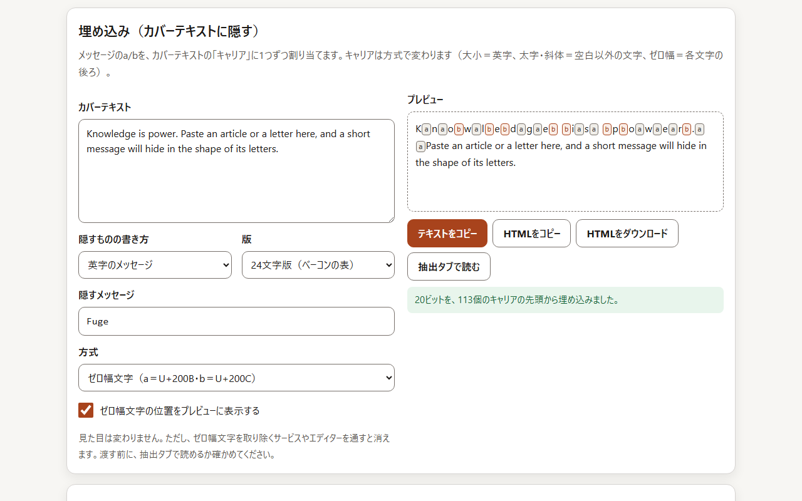

<!--
---
title: Bacon CipherLab
category: classic-crypto
difficulty: 2
description: Educational Bacon’s Cipher lab: encoding/decoding, steganographic embedding, and historical insights.
tags: [bacon-cipher, classical-cryptography, steganography, cryptanalysis, education, web-tool]
demo: https://ipusiron.github.io/bacon-cipherlab/
---
-->

# 🥓 Bacon CipherLab - ベーコン暗号の体験ツール


[](https://ipusiron.github.io/bacon-cipherlab/)

**Day055 - 生成AIで作るセキュリティツール100**

ベーコン暗号（Bacon’s Cipher）をテーマにした学習・体験用のWebツールです。  

「平文⇔暗号文」の変換だけでなく、カバーテキストへの埋め込み・抽出を通して、ステガノグラフィー的な暗号の思想を理解できます。

---

## 🌐 デモページ

👉 **[https://ipusiron.github.io/bacon-cipherlab/](https://ipusiron.github.io/bacon-cipherlab/)**

ブラウザーで直接お試しいただけます。

---

## 📸 スクリーンショット



*ダミー*

---

## ✨ 主な機能（仕様）

本ツールは以下のタブ構成で動作します。

1. **Encode（暗号化）**  
   - 平文を入力し、A/B列または0/1列に変換  
   - バリアント切替（24文字 I/J・U/V統合 / 24文字 I/J統合のみ / 26文字版）  
   - 出力形式：A/B、0/1、ブロック区切り（5文字・10文字）  
   - 変換結果をコピー・ダウンロード可能

2. **Decode（復号）**  
   - A/B列または0/1列を入力して平文へ復号  
   - 不足ビットのパディング警告やエラー箇所の強調表示  
   - バリアント切替に対応

3. **Cover Embed（埋め込み）**  
   - カバーテキストに暗号列（A/B）を埋め込む  
   - 埋め込み方式：  
     - 小文字/大文字  
     - 通常/太字  
     - 通常/斜体  
     - 不可視文字（ゼロ幅スペースなど）  
   - カバー容量チェックと収容可能性をゲージ表示

4. **Cover Extract（抽出）**  
   - 埋め込まれたテキストから暗号列を抽出  
   - 抽出方式を指定し、A/B・0/1・平文に復号

5. **Matrix / History（対応表と史的バリアント）**  
   - 5×5または5×6のビット対応表を表示  
   - I/JやU/V統合などの歴史的バリアント比較  
   - クリックで符号列コピー

6. **Help（座学）**  
   - ベーコン暗号の定義  
   - 「優れた暗号の3条件」（ベーコンによる）  
   - フリードマン夫妻と墓碑エピソード  
   - エリザベス・フリードマン再評価の流れ  
   - 暗号としての限界とステガノグラフィー的意義  

---

## 🕮 ベーコンの暗号観

フランシス・ベーコンは"The Advancement of Learning"（『学問の進歩』、1605）において、  
「優れた暗号には次の3つの特徴が必要である」と述べています。

1. **容易さ（Ease）**  
   書くのが簡単で、利用者に過度の負担をかけないこと。

2. **安全性（Safeness）**  
   第三者に破られにくく、内容を秘匿できること。

3. **秘匿性（Not raising suspicion）**  
   暗号を使っていると気づかれないこと。疑念を抱かせないこと。

この3条件は、のちに考案された **ベーコン暗号（Bacon’s Cipher）** にも反映されています。

文字を単に変換するのではなく、字体や装飾などに「A/B」のビットを忍ばせる発想は、まさに「疑念を抱かせない」＝ステガノグラフィーの精神を体現しています。

---

## 🪦 歴史的エピソード：フリードマン夫妻とベーコン暗号

アメリカの暗号研究の先駆者 **ウィリアム・F・フリードマン** と妻の **エリザベス・F・フリードマン** は、20世紀に暗号学を学問として確立させた人物です。

夫妻の墓石には、"KNOWLEDGE IS POWER"が刻まれています。


たとえば、'E'に注目してみてください。
'E'は3文字ありますが、よく見ると異なる書体が使われています。
セリフ体とサンセリフ体です。

セリフ体を大文字のまま、サンセリフ体を小文字にすると、以下のように変換されます。

```
KnOwledGe Is pOwEr
```

暗号学では一般に5文字グループに分けられますので、それを適用してみます。

```
KnOwl edGeI spOwE r
```

さらに、子文字をaスタイル、大文字をbスタイルとしてタグ付けします。

```
KnOwl edGeI spOwE r
babaa aabab aabab a
```

これをベーコン暗号だと仮定して解読すると、"WFF"という文字列が得られます。
この文字列は、夫のウイリアム・F・フリードマンのイニシャルそのものです。

### 参考

- [Cipher on the William and Elizebeth Friedman tombstone at Arlington National Cemetery is solved.](https://elonka.com/friedman/)

---

## ⚠️ 注意点

- ベーコン暗号は**古典暗号の一種**であり、現代的な暗号強度はありません。  
- 「疑念を抱かせない」ためのステガノグラフィー的利用に意義があるものの、  
  セキュリティ上の安全策としては利用できません。  

---

## 📄 ライセンス

MIT License - 詳細は [LICENSE](LICENSE) をご覧ください。

---

## 🛠 このツールについて

本ツールは、「生成AIで作るセキュリティツール100」プロジェクトの一環として開発されました。  
このプロジェクトでは、AIの支援を活用しながら、セキュリティに関連するさまざまなツールを100日間にわたり制作・公開していく取り組みを行っています。  

プロジェクトの詳細や他のツールについては、以下のページをご覧ください。

🔗 [https://akademeia.info/?page_id=42163](https://akademeia.info/?page_id=42163)
